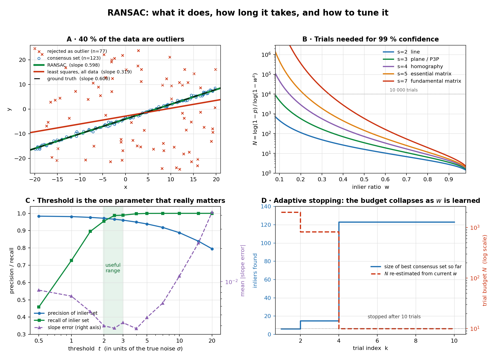
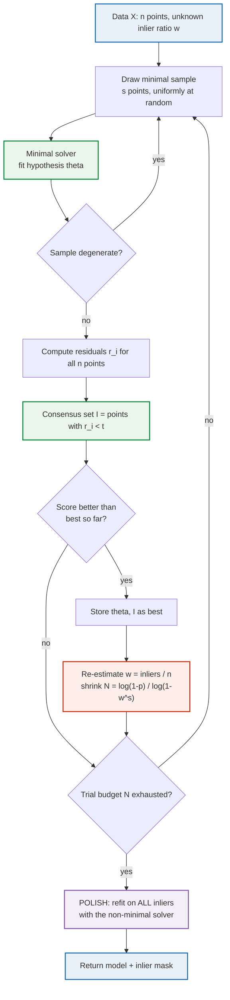
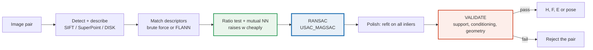
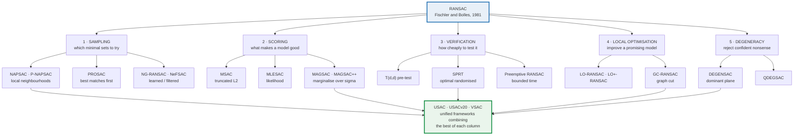

# RANSAC — From Greenhand to Expert

### A complete, verified tutorial on RANdom SAmple Consensus

---

## 0 · How to read this tutorial

| Part | Title | For you if… |
|---|---|---|
| **I** | Why RANSAC exists | you have never used it |
| **II** | The algorithm | you want to *understand* it, not just call it |
| **III** | The mathematics | you want to defend your parameter choices |
| **IV** | Build it yourself | you learn by writing code |
| **V** | The library toolbox | you have a deadline |
| **VI** | Geometric vision | you work with images or point clouds |
| **VII** | Failure modes | your RANSAC "works, except sometimes" |
| **VIII** | The variant zoo | you want the 2026 state of the art |
| **IX** | Neighbours & alternatives | you want to know when *not* to use it |
| **X** | Advanced topics | you fit multiple models, or want to learn the sampler |
| **XI** | Tuning playbook | you want a one-page cheat sheet |
| **XII** | Exercises | you want to check you really got it |

Every code block in this document was executed before publication; every number in every table
was computed, not recalled; every reference was checked against the primary source. Figure 1
is generated by `make_figs.py`, which ships alongside this document together with the RANSAC
engine of Part IV (`ransac_from_scratch.py`).

---

## 1 · First things first: the name

> **RANSAC = RANdom SAmple Consensus.**

It is often misremembered as *"Randomized Sampling and Consensus"* — close in spirit, but not the
official expansion, and the difference matters when you search the literature. The name comes
from the title of the founding paper:

> Martin A. Fischler and Robert C. Bolles, **"Random Sample Consensus: A Paradigm for Model
> Fitting with Applications to Image Analysis and Automated Cartography"**,
> *Communications of the ACM*, vol. 24, no. 6, pp. 381–395, June 1981.
> DOI [10.1145/358669.358692](https://doi.org/10.1145/358669.358692) ·
> free PDF at [SRI International](https://www.sri.com/wp-content/uploads/2021/12/ransac-publication.pdf)

Two further points about what RANSAC is, because getting these straight early saves a lot of
confusion later:

**RANSAC is not a "math tool" in the sense of a theorem or a closed-form formula.** It is a
*randomized algorithm* — more precisely a **meta-algorithm** (a *paradigm*, in Fischler and
Bolles's own word). It does not fit models itself. It wraps around a fitting routine that you
supply, and makes that routine survive corrupted data. Swap in a line solver and you get robust
line fitting; swap in a homography solver and you get image stitching. The wrapper never changes.

**Its output is random.** Two runs on identical input can return different answers. This is not a
bug, it is the defining property, and §8.5 explains how to live with it.

Also worth knowing, since you will meet these strings in papers and code: the whole family of
methods is called **SAC** (SAmple Consensus), which is why the variants are named MSAC, MLESAC,
PROSAC, MAGSAC, VSAC, and so on. PCL's module is literally called `sample_consensus`.

---

# Part I · Why RANSAC exists

## 2.1 · The breakdown-point problem

Classical estimators minimise a sum of squared residuals:

```
minimise  Σ r_i²    over all model parameters
```

This is optimal — provably, by Gauss–Markov — when every measurement is a true measurement
corrupted only by zero-mean, finite-variance noise. It is *catastrophically* non-optimal when some
measurements are not measurements of your model at all.

The distinction is the single most important idea in robust statistics:

| | **Noise** | **Outliers (gross errors)** |
|---|---|---|
| Source | sensor jitter, quantisation, discretisation | wrong correspondence, wrong object, sensor failure, a second structure in the scene |
| Distribution | narrow, roughly Gaussian, centred on the model | arbitrary, unbounded, unmodelled |
| Magnitude | a fraction of a pixel / millimetre | anything at all |
| Least squares | handles it optimally | destroyed by a single one |

The formal measure is the **breakdown point**: the smallest fraction of arbitrarily corrupted data
that can drag an estimate arbitrarily far from the truth.

| Estimator | Breakdown point |
|---|---|
| Ordinary least squares | **0 %** — one bad point with large leverage is enough |
| Huber M-estimator (fixed scale) | **0 %** — bounded influence in `y`, none against high-leverage `x` |
| Least Median of Squares | **50 %** — the theoretical ceiling for a regression-equivariant estimator |
| **RANSAC** | **>50 %**, limited only by your compute budget and by ambiguity |

That last row is the whole reason RANSAC has been cited more than 25,000 times and lives inside
almost every camera, drone, robot, and 3-D scanner you will ever touch.

## 2.2 · A worked failure of least squares

Here is the canonical demonstration, with real numbers from a run you can reproduce (§5.3).

Generate 120 points on the line `y = 0.6x − 4` with Gaussian noise `σ = 0.4`, then add 80 points
drawn uniformly at random from the surrounding rectangle — a **40 % outlier rate**, which is
entirely ordinary for image feature matching.

| Method | Recovered slope | Recovered intercept | Slope error |
|---|---|---|---|
| Ground truth | 0.600 | −4.000 | — |
| Least squares on all 200 points | **0.319** | −2.834 | **47 % low** |
| RANSAC (10 trials, then refit on inliers) | **0.598** | −4.014 | **0.3 % low** |

Least squares did not degrade gracefully. It returned a line that fits nothing — pulled halfway
towards the centroid of the outlier cloud, because squaring a residual of 20 contributes 2,500
times more to the objective than squaring a residual of 0.4. **The outliers outvote the signal by
weight even though they are outnumbered by count.**

Panel A of Figure 1 shows this: the red least-squares line slicing through empty space while the
green RANSAC line sits exactly on the black dashed ground truth.



*Figure 1. (A) The core idea, on data with 40 % outliers. (B) Required trials versus inlier ratio
for the five most common minimal sample sizes. (C) The threshold sweep — precision, recall and
accuracy versus threshold, averaged over 40 runs. (D) Adaptive termination in action: the trial
budget collapses from 2,000 to 10 as the inlier ratio is discovered.*

## 2.3 · The inversion of logic

The reason RANSAC feels strange at first is that it inverts the classical procedure.

| | Classical fitting | RANSAC |
|---|---|---|
| Uses | **all** the data, **once** | a **minimal** subset, **many times** |
| Direction | data → model | model → data |
| Goal | minimise total error | **maximise the number of points that agree** |
| Rejects outliers by | down-weighting them | *excluding* them from a hypothesis, then testing |

Fischler and Bolles's insight was this. You cannot identify the outliers before you know the
model, and you cannot fit the model reliably before you remove the outliers — a chicken-and-egg
deadlock. But if you pick just *two* points at random from 200, there is a reasonable chance
(here, 0.6² = 36 %) that **both happen to be inliers**. A model fitted to two clean points is
already approximately correct, so most of the other inliers will fall close to it, and they can
now be recognised. Repeat enough times and you will draw a clean pair almost surely.

So: **use uncontaminated small samples to reveal the inliers, and then use all the inliers to fit
precisely.** The smaller the sample, the higher the chance it is clean — which is why RANSAC always
uses the *minimal* sample size, not a comfortable one. Two points for a line, never three.

This also tells you immediately what RANSAC's cost structure is, and it is delightfully
counter-intuitive: **the difficulty of a robust fitting problem is governed not by the number of
data points, but by the minimal sample size and the inlier ratio.** A million points at 80 %
inliers is easy — a handful of trials. Fifty points at 25 % inliers is easy too *if* you are
fitting a line (`s = 2`, 72 trials), and close to hopeless if you are fitting a fundamental
matrix (`s = 7`: with only 12 inliers among the 50 points, the exact without-replacement count of
§4.5 is over half a million trials).

---

# Part II · The algorithm

## 3.1 · The four ingredients you must supply

RANSAC is a template with four holes. Fill them in and you have a robust estimator for your
problem.

| # | Ingredient | Symbol | Line fitting | Homography |
|---|---|---|---|---|
| 1 | **Minimal solver** — fits the model to the fewest points that determine it | `s` | 2 points → line | 4 correspondences → 3×3 `H` |
| 2 | **Residual function** — distance from a datum to a model, in meaningful units | `r(θ, x)` | perpendicular distance | symmetric reprojection error, in pixels |
| 3 | **Inlier threshold** — how close counts as agreement | `t` | ≈ 2–3 σ | 1–4 px |
| 4 | **Scoring rule** — what makes one hypothesis better than another | — | count of inliers (better: MSAC, §5.4) | count of inliers (better: MSAC, §5.4) |

Ingredient 3 is the only one that genuinely requires judgement, and it is where beginners lose
most of their accuracy. §4.8 gives it a principled treatment and Panel C of Figure 1 shows the
empirical cost of getting it wrong.

## 3.2 · Pseudocode

```text
INPUT   X      : data, n items
        s      : minimal sample size
        t      : inlier threshold
        N      : maximum trials
        p      : desired confidence        (e.g. 0.99)

best_score   ← −∞
best_inliers ← ∅

for k = 1 … N:

    # ---- 1. HYPOTHESISE ------------------------------------------------
    S ← s items drawn uniformly at random from X, without replacement
    θ ← minimal_solver(S)
    if θ is undefined:                       # degenerate sample
        continue

    # ---- 2. VERIFY -----------------------------------------------------
    r ← residuals(θ, X)                      # all n items
    I ← { i : r_i < t }                      # the consensus set

    # ---- 3. SCORE AND KEEP THE BEST ------------------------------------
    #      score = |I|, ties broken by the smaller total residual
    #      (or, better, the MSAC cost of §5.4)
    if score(I, r) > best_score:
        best_score, best_inliers, best_θ ← score(I, r), I, θ

        # ---- 4. ADAPTIVE TERMINATION -----------------------------------
        w ← |I| / n                          # inlier-ratio estimate
        N ← min( N, ceil( log(1−p) / log(1−w^s) ) )

# ---- 5. POLISH -----------------------------------------------------------
θ* ← non_minimal_solver(X[best_inliers])     # least squares on ALL inliers

return θ*, best_inliers
```

Five stages: **hypothesise → verify → score → adapt → polish.** Every variant in Part VIII is a
better idea about one of those five stages, and nothing else. Once you see the algorithm this way,
the variant zoo stops being a zoo and becomes a table.

**Step 5 is not optional.** A model from a 2-point sample is *unbiased but noisy*: it used two
measurements when 123 were available. Refitting on the full consensus set is what converts a
rough hypothesis into a precise estimate. Measured over 200 runs of the line problem in §5.3
(fresh data for each run, MSAC scoring, `t = 1.2`), the polish step cuts the mean slope error from
0.0169 to 0.0046 — a **3.6× improvement, for free**; the gain grows with the number of inliers
and with `s`. Beginners who skip it wonder why
RANSAC is "imprecise". RANSAC is not imprecise; a 2-point fit is.

## 3.3 · The loop, as a picture



## 3.4 · A micro-example you can check by hand

Six points, fitting a line, threshold `t = 1.0`:

| i | point | on the line `y = x`? |
|---|---|---|
| 1 | (0, 0) | yes |
| 2 | (1, 1) | yes |
| 3 | (2, 2) | yes |
| 4 | (3, 3) | yes |
| 5 | (1, 9) | **no — outlier** |
| 6 | (2, −8) | **no — outlier** |

**Trial 1** draws points 5 and 6. The line through (1, 9) and (2, −8) is `y = −17x + 26`, i.e.
`17x + y − 26 = 0`, normalised `(17x + y − 26)/√290`. Distances:

| point | distance |
|---|---|
| (0,0) | 26/17.03 = **1.53** |
| (1,1) | 8/17.03 = 0.47 ✓ |
| (2,2) | 10/17.03 = 0.59 ✓ |
| (3,3) | 28/17.03 = **1.64** |
| (1,9) | 0 ✓ |
| (2,−8) | 0 ✓ |

Consensus set size **4**. Note the trap: this catastrophically wrong model still collected four
points, two of them genuine inliers that happen to lie near the bad line. A single trial proves
nothing.

**Trial 2** draws points 1 and 3. The line is `y = x`, i.e. `(x − y)/√2 = 0`. Distances: points
1–4 are exactly 0 ✓✓✓✓; point 5 is 8/1.414 = 5.66 ✗; point 6 is 10/1.414 = 7.07 ✗.

Consensus set size **4** again — tied! And this is exactly why the tie-break in the pseudocode
matters. Trial 1's inliers have total residual 0.47 + 0.59 + 0 + 0 = 1.06; trial 2's have total
residual 0. Trial 2 wins on the tie-break, and the algorithm keeps the correct model.

Add a seventh true inlier at (4, 4) and the tie disappears: trial 2 would collect 5, trial 1 still
4. With realistic data, correct models win by a wide margin and ties never arise — but small
problems are exactly where they do, and a scoring rule of "inlier count only" is genuinely
ambiguous there. (This observation, taken seriously, is the origin of MSAC and MLESAC; see §9.1.)

---

# Part III · The mathematics

This is the part that turns a user into an expert. Three questions have clean closed-form
answers — how likely is a clean sample, how many trials do I need, how long will it really take —
two have important corrections that most treatments omit (§4.5, §4.7), and two are the parameter
choices you will actually be judged on (§4.8, §4.9).

## 4.1 · What is the probability that a single sample is clean?

Let `w` be the **inlier ratio** — the probability that a randomly chosen datum is an inlier — and
let `s` be the minimal sample size. Drawing `s` items independently (see §4.5 for the
without-replacement correction):

$$P(\text{sample is all-inlier}) \;=\; w^{s}$$

A clean sample is called **uncontaminated** or **all-inlier**. This one expression is the engine of
every RANSAC cost analysis, and it carries a stark message: the probability decays
*exponentially* in `s`. At `w = 0.5`, a 2-point sample is clean 25 % of the time, a 7-point sample 0.78 % of the
time. **Every extra point in your minimal sample is exponentially expensive.** That is why the
five-point algorithm for the essential matrix was a major result, and why people write papers
about solvers that shave a single point off the sample.

## 4.2 · How many trials do I need? — the fundamental formula

The probability that *all* of `N` independent samples are contaminated is `(1 − wˢ)ᴺ`. We want the
probability of at least one clean sample to be at least `p` (our confidence, conventionally 0.99):

$$1-(1-w^{s})^{N} \;\ge\; p
\quad\Longleftrightarrow\quad
(1-w^{s})^{N} \;\le\; 1-p$$

Take logarithms. Both `log(1 − wˢ)` and `log(1 − p)` are negative, so dividing by the former flips
the inequality:

$$\boxed{\;N \;\ge\; \frac{\log(1-p)}{\log\!\left(1-w^{s}\right)}\;}$$

```
                 log(1 - p)
    N  =  ceil( ------------- )          p = confidence  (0.99)
               log(1 - w^s)              w = inlier ratio
                                         s = minimal sample size
```

Three properties worth internalising:

1. **`n` does not appear.** The number of data points is absent. Doubling your dataset does not
   change the number of trials by one — it only makes each trial more expensive to verify. This is
   RANSAC's most surprising and most useful property.
2. **`N` grows only logarithmically in `1/(1−p)`.** Going from 99 % to 99.99 % confidence merely
   doubles the trial count. Confidence is cheap; buy plenty.
3. **`N` grows like `w⁻ˢ`.** This is the wall. It is exponential in `s` and polynomial-of-high-degree
   in `1/w`, and it is why low-inlier-ratio problems with large minimal samples are the hard cases.

## 4.3 · The table every practitioner should know

Exact values of `N = ⌈log(0.01) / log(1 − wˢ)⌉` for **p = 0.99**:

| `w` ↓  `s` → | **1** | **2**<br/>line | **3**<br/>plane, P3P | **4**<br/>homography | **5**<br/>essential | **6** | **7**<br/>fundamental | **8**<br/>8-pt F |
|---|---|---|---|---|---|---|---|---|
| **0.90** | 2 | 3 | 4 | 5 | 6 | 7 | 8 | 9 |
| **0.80** | 3 | 5 | 7 | 9 | 12 | 16 | 20 | 26 |
| **0.70** | 4 | 7 | 11 | 17 | 26 | 37 | 54 | 78 |
| **0.60** | 6 | 11 | 19 | 34 | 57 | 97 | 163 | 272 |
| **0.50** | 7 | 17 | 35 | 72 | 146 | 293 | 588 | 1 177 |
| **0.40** | 10 | 27 | 70 | 178 | 448 | 1 123 | 2 809 | 7 025 |
| **0.30** | 13 | 49 | 169 | 567 | 1 893 | 6 315 | 21 055 | 70 188 |
| **0.20** | 21 | 113 | 574 | 2 876 | 14 389 | 71 954 | 359 777 | 1 798 893 |
| **0.10** | 44 | 459 | 4 603 | 46 050 | 460 515 | 4 605 168 | 46 051 700 | 460 517 017 |

Read this table diagonally and the engineering reality jumps out. The top-left region is free. The
bottom-right region is a wall you cannot climb with plain uniform sampling. You need either
*fewer* samples (PROSAC, NAPSAC — they change which minimal sets you try), *cheaper* samples
(SPRT, `T_{d,d}` — these leave `N` untouched but slash the cost of each trial), or a higher `w`
from a better matcher (Part VIII). Panel B of Figure 1 is this table as curves.

Two landmarks worth memorising: **`w = 0.5`, `s = 4` → 72 trials** (a homography from 50 %-correct
matches is trivially cheap) and **`w = 0.3`, `s = 7` → 21,055 trials** (a fundamental matrix from
30 %-correct matches is a real computation).

## 4.4 · How long will it *actually* take?

`N` is a worst-case budget, not an expectation. The number of trials until the *first* clean sample
is a geometric random variable with success probability `q = wˢ`:

| quantity | value | at `w=0.5, s=4` | at `w=0.4, s=7` |
|---|---|---|---|
| Expected trials to first clean sample | `1/q` | **16** | **610** |
| Standard deviation | `√(1−q) / q` | **15.5** | **610** |
| Budget `N` for `p = 0.99` | `log(0.01)/log(1−q)` | **72** | **2 809** |

Notice that **the standard deviation is almost equal to the mean.** For a geometric distribution the
coefficient of variation is `SD/mean = √(1−q)`, which is ≈ 1 whenever `q = wˢ` is small — so the
spread of RANSAC's runtime is as large as the runtime itself. The practical consequences:

- **Never report a single timing.** Report the median and the 95th percentile over many runs.
- **Never budget for the mean** in a real-time system. Budget for `N`, or cap hard and detect
  failure.
- Because the mean is roughly `N/4.6`, RANSAC usually finishes far sooner than its worst case —
  which is exactly what adaptive termination (§4.6) exploits.

Here is the script behind the numbers above:

```python
import math

def trials_needed(w, s, p=0.99):
    """Worst-case trial budget for confidence p."""
    # log1p(-q) == log(1 - q), but stays accurate when q = w**s is tiny
    return math.ceil(math.log(1.0 - p) / math.log1p(-(w ** s)))

def trial_stats(w, s, p=0.99):
    q = w ** s
    return {
        "P(clean sample)": q,
        "E[trials to first clean]": 1.0 / q,
        "SD[trials]": math.sqrt(1.0 - q) / q,
        "budget N": trials_needed(w, s, p),
    }

for w, s in [(0.5, 2), (0.5, 4), (0.4, 7), (0.3, 8)]:
    st = trial_stats(w, s)
    print(f"w={w} s={s}: N={st['budget N']:>6}  "
          f"E={st['E[trials to first clean]']:>9.1f}  "
          f"SD={st['SD[trials]']:>9.1f}")
```

```text
w=0.5 s=2: N=    17  E=      4.0  SD=      3.5
w=0.5 s=4: N=    72  E=     16.0  SD=     15.5
w=0.4 s=7: N=  2809  E=    610.4  SD=    609.9
w=0.3 s=8: N= 70188  E=  15241.6  SD=  15241.1
```

## 4.5 · The correction almost everyone forgets: sampling without replacement

`wˢ` assumes independent draws. Real implementations sample **without replacement** (you must not
pick the same point twice — it would make the sample degenerate). The exact probability is
hypergeometric: with `I = wn` inliers among `n` points,

$$P(\text{clean}) \;=\; \frac{\binom{I}{s}}{\binom{n}{s}} \;=\; \prod_{j=0}^{s-1}\frac{I-j}{n-j}$$

which is **always smaller** than `wˢ`. So the familiar formula is *optimistic*: it under-estimates
the trials needed. A first-order expansion shows exactly what controls the gap:

$$\frac{P(\text{clean})}{w^{s}} \;\approx\; 1-\frac{s(s-1)(1-w)}{2\,w\,n}$$

so the error scales with **`s²`** and with **`1/(wn)`** — not with `n/s`, as is often assumed.
Checked against exact values:

| `n` | `w` | `s` | `wˢ` | exact | exact / `wˢ` | approximation above |
|---|---|---|---|---|---|---|
| 1 000 | 0.40 | 7 | 0.001638 | 0.001587 | 0.969 | 0.969 |
| 200 | 0.50 | 4 | 0.062500 | 0.060620 | 0.970 | 0.970 |
| 200 | 0.50 | 7 | 0.007813 | 0.007009 | 0.897 | 0.895 |
| 100 | 0.60 | 4 | 0.129600 | 0.124358 | 0.960 | 0.960 |
| 50 | 0.50 | 7 | 0.007813 | 0.004813 | **0.616** | 0.580 |
| 20 | 0.50 | 4 | 0.062500 | 0.043344 | **0.693** | 0.700 |

**Rule of thumb:** the gap stays under 5 % when `n > 10·s(s−1)(1−w)/w` — that is `n > 120` for a
homography at `w = 0.5`, but `n > 420` for a 7-point fundamental matrix at the same `w`. Below
that, the shortfall is real: estimating `F` from **40 correspondences at `w = 0.5`, the standard
formula asks for 588 trials where 1,106 are genuinely needed — a 47 % under-estimate.** Multiply
your budget by 2–3 for small `n`, or compute the hypergeometric probability directly:

```python
from math import comb, log, log1p, ceil

def trials_needed_exact(n_inliers, n_total, s, p=0.99):
    """Trial budget accounting for sampling without replacement."""
    if n_inliers < s:
        return float("inf")
    q = comb(n_inliers, s) / comb(n_total, s)
    if q >= 1.0:
        return 1
    return ceil(log(1.0 - p) / log1p(-q))

print(trials_needed_exact(25, 50, 7))   # 955  (vs 588 from the w^s formula)
```

## 4.6 · Adaptive termination — never hard-code `N`

The formula needs `w`, which is precisely what you do not know. The fix, standard since Hartley and
Zisserman's *Multiple View Geometry* (Algorithm 4.5), is beautifully simple: **start pessimistic,
then re-estimate `w` from the best consensus set found so far and shrink `N` accordingly.**

```python
N = float("inf")          # start pessimistic
k = 0
while k < N and k < max_trials:
    k += 1
    # ... hypothesise, verify ...
    if len(inliers) > len(best_inliers):
        best_inliers = inliers
        w = len(inliers) / n
        N = min(N, math.log(1 - p) / math.log1p(-(w ** s)))   # only ever shrinks
```

Panel D of Figure 1 shows the effect on the line-fitting problem. The budget sits at the 2,000
hard cap while only a 6-inlier model is known, drops to **817** at trial 2 when a 15-inlier model
appears, and collapses to **10** at trial 4 the moment the 123-inlier model is found — at which
point the loop exits. The run took **10 trials instead of 2,000**.

Three subtleties that separate the expert from the user:

1. **The estimate of `w` is biased upward**, because you are taking the *maximum* consensus size
   over many trials, and a maximum of noisy estimates over-estimates. So `N` is shrunk slightly
   too aggressively. In practice this is harmless; if you need to be careful, add one or two
   standard deviations of the trial count, `√(1−wˢ)/wˢ`, as Fischler and Bolles already suggested
   in the original paper, or simply enlarge `p`.
2. **Always keep a hard `max_trials` cap.** With `w` genuinely tiny, `N` is astronomical, and an
   uncapped loop hangs. Every serious library has this cap: OpenCV's `findHomography` defaults
   to `maxIters = 2000` (`findFundamentalMat` and `findEssentialMat` to 1,000), scikit-learn's
   `max_trials` to 100.
3. **`N` can only decrease.** Never let a later, worse consensus set raise it again.

## 4.7 · What the guarantee does *not* say

This is the single most common expert-level misconception, so read it twice.

> `N = log(1−p)/log(1−wˢ)` guarantees, with probability `p`, that **at least one sample consisting
> entirely of inliers was drawn**. It guarantees *nothing whatsoever* about the accuracy of the
> returned model, and nothing about that sample being *selected* as the best.

Three distinct things can go wrong even when the clean sample was drawn:

- **A clean sample can still be a bad sample.** Two inliers that happen to be adjacent give a line
  whose direction is wildly uncertain; four correspondences with any three of them collinear give
  a degenerate homography. Clean ≠ well-conditioned. This is why NeFSAC filters minimal samples for conditioning, and why
  LO-RANSAC's local optimisation helps so much.
- **A contaminated sample can win the scoring.** With many outliers and a loose threshold, a wrong
  model can collect more points than the right one — exactly the trap in §3.4. Panel C of Figure 1
  quantifies it: at `t = 20σ`, inlier-set precision falls to 0.80 and the slope error is 11 times
  its minimum.
- **Degenerate configurations can produce a wrong model with genuinely high support.** The dominant
  plane problem in fundamental matrix estimation is the classic case (§8.1).

The practical upshot: **treat `p` as a budgeting device, not a correctness certificate.** Always
validate the returned model independently — inlier count relative to expectation, residual
distribution, geometric plausibility (§8.6).

## 4.8 · Choosing the threshold, properly

The threshold `t` is the one parameter with no safe default, and Panel C of Figure 1 shows why it
deserves care. Averaged over 40 runs of the line problem with true noise `σ = 0.4` (these are the
exact numbers plotted in Panel C, as computed by `make_figs.py`):

| `t` (in units of σ) | inlier-set precision | inlier-set recall | mean slope error |
|---|---|---|---|
| 0.5 σ | 0.984 | 0.458 | 0.0084 |
| 1.0 σ | 0.981 | 0.727 | 0.0074 |
| **2.0 σ** | 0.972 | **0.955** | **0.0040** |
| **2.5 σ** | 0.966 | **0.988** | **0.0038** |
| **3.0 σ** | 0.961 | **0.989** | **0.0043** |
| 4.0 σ | 0.949 | 0.998 | 0.0038 |
| 5.0 σ | 0.939 | 1.000 | 0.0047 |
| 10.0 σ | 0.888 | 1.000 | 0.0113 |
| 20.0 σ | 0.795 | 1.000 | 0.0425 |

The shape is a U: **too tight throws away real inliers** (recall 0.46 at 0.5 σ — you are
fitting to under half your data and the estimate gets noisy), **too loose admits outliers into the
final least-squares refit** (precision 0.80 at 20 σ, and the slope error is 11× its minimum). The
optimum sits at **2–4 σ**, and it is broad — anywhere in 2–5 σ is within about 25 % of the best.
This is reassuring: you do not need to know `σ` precisely, only within a factor of about two.

Now the principled version. If inlier residuals are Gaussian with standard deviation `σ`, then the
sum of squared residuals over the `m` degrees of freedom of the error is **chi-squared with `m`
degrees of freedom**, where `m` is the *codimension* of the model — the number of independent
directions in which a datum can deviate. Choosing `t` as the 95th percentile gives:

| Model | Error measured as | Codim. `m` | `t² / σ²` | `t / σ` |
|---|---|---|---|---|
| 2-D line, 3-D plane | point-to-surface distance | 1 | 3.841 | **1.96** |
| Fundamental / essential matrix | point-to-epipolar-line distance | 1 | 3.841 | **1.96** |
| Homography, camera matrix | 2-D reprojection error | 2 | 5.991 | **2.45** |
| Trifocal tensor | 3-D transfer error | 3 | 7.815 | **2.79** |

```python
from scipy.stats import chi2
t_over_sigma = {m: float(chi2.ppf(0.95, m)) ** 0.5 for m in (1, 2, 3, 4)}
# {1: 1.960, 2: 2.448, 3: 2.795, 4: 3.080}
```

This is exactly the 2–3 σ band the experiment found, from first principles. Practical guidance:

- **Images, well-calibrated features (SIFT/SuperPoint + a good matcher):** `σ ≈ 0.5–1 px`, so
  `t = 1–3 px`. OpenCV's own documentation recommends 1–10 px for `ransacReprojThreshold`.
- **Images, semantic or learned correspondences:** `σ` can be several pixels; `t = 4–10 px`.
- **LiDAR / depth sensors:** use the datasheet noise figure. Typical indoor RGB-D plane fitting:
  `t = 0.01–0.02 m`.
- **Unknown noise scale:** use **MAGSAC++** (§9.1), which marginalises over `σ` instead of fixing it.
  Benchmarks found it to be the only method whose optimal threshold was stable across datasets —
  which is exactly the property you want when you cannot tune.
- **Estimate `σ` from the data:** a robust scale estimate from the current inliers,
  `σ̂ = 1.4826 · MAD(r)` over the *signed* residuals — equivalently `1.4826 · median|r|` for
  unsigned point-to-model distances of codimension 1 — then `t = 2.5 σ̂`, iterated 2–3 times,
  works well. This is the idea
  behind LO-RANSAC's inner loop. Note that scikit-learn's default is *cruder* than this — it uses
  the MAD of the target values `y`, not of the residuals, which is only a rough scale proxy. Set
  `residual_threshold` explicitly whenever you know your noise level.

## 4.9 · Computational complexity

Per trial you pay for one minimal solve plus `n` residual evaluations:

$$\text{Cost} \;=\; N\bigl(C_{\text{solve}} + n\,C_{\text{residual}}\bigr) \;+\; C_{\text{polish}}$$

For anything but tiny datasets, `n · C_residual` dominates completely — verification, not
hypothesis generation, is the bottleneck. A fundamental-matrix RANSAC with `N = 20,000` and
`n = 2,000` correspondences performs 40 million residual evaluations. This single observation
launched an entire research line:

- **`T_{d,d}` pre-test** (Chum & Matas, 2002): check `d` random points first (usually `d = 1`);
  if any fails, discard the hypothesis without touching the other `n − d`. Since the vast majority
  of hypotheses are bad, this eliminates most of the work.
- **SPRT** (Matas & Chum, 2005; Chum & Matas, 2008): Wald's sequential probability ratio test
  applied to verification — evaluate residuals one at a time and stop as soon as the evidence is
  decisive. Provably optimal in the expected-time sense, and the reason it is enabled for *every*
  `USAC_*` flag in OpenCV.
- **Preemptive RANSAC** (Nistér, 2003): generate a fixed pool of hypotheses and score them all in
  breadth-first order on a growing subset of data, pruning as you go. Bounded runtime, which is
  what a real-time system needs.

If you are writing your own, two cheap wins before you reach for any of these: **vectorise the
residual computation** (one NumPy expression over all `n` points, never a Python loop) and
**early-terminate scoring** once the running count cannot beat the best so far.

---

# Part IV · Build it yourself

Nothing makes RANSAC click like implementing it. What follows is a complete, tested engine in
about 120 lines of NumPy, plus three models. Every line has been executed; the output at the end
of this section is the real output.

## 5.1 · The engine

Note the design: the engine knows nothing about geometry. It receives a `fit` function, a
`residuals` function, and a sample size. That separation is what makes RANSAC a paradigm rather
than an algorithm.

```python
from __future__ import annotations
import math
from dataclasses import dataclass, field
from typing import Callable, Optional
import numpy as np


@dataclass
class RansacResult:
    model: object
    inliers: np.ndarray          # boolean mask, length n
    n_trials: int
    inlier_ratio: float
    residual_scale: float        # robust sigma estimate from the inliers
    converged: bool = field(default=True)   # confidence reached within cap


def ransac(
    data, fit, residuals, min_samples, threshold, *,
    max_trials=10_000, confidence=0.99, refit=None,
    score="msac", is_sample_valid=None, rng=None,
):
    """
    Robustly fit a model to `data` in the presence of outliers.

    data          (n, ...) array; row i is one datum.
    fit           fit(sample) -> model, or None if the sample is degenerate.
    residuals     residuals(model, data) -> (n,) non-negative errors.
    min_samples   s, the minimal sample size for `fit`.
    threshold     t, the inlier threshold, in the units of `residuals`.
    max_trials    hard cap; ALWAYS keep one.
    confidence    p, probability of drawing >= 1 uncontaminated sample.
    refit         non-minimal solver used to polish on the consensus set.
    score         "ransac" -> inlier count       (Fischler & Bolles 1981)
                  "msac"   -> truncated L2 cost  (Torr & Zisserman 2000)
    is_sample_valid  optional cheap pre-check on the drawn sample.
    rng           seed or np.random.Generator, for reproducibility.
    """
    rng = np.random.default_rng(rng)
    data = np.asarray(data)
    n = len(data)
    if n < min_samples:
        raise ValueError(f"need >= {min_samples} data points, got {n}")
    if score not in ("ransac", "msac"):
        raise ValueError("score must be 'ransac' or 'msac'")
    if not 0.0 < confidence < 1.0:
        raise ValueError("confidence must lie strictly between 0 and 1")

    t2 = threshold * threshold
    best_model, best_score = None, -np.inf
    best_inliers = np.zeros(n, dtype=bool)
    trials, budget = 0, math.inf          # adaptive N; only ever shrinks

    while trials < min(budget, max_trials):
        trials += 1

        # ---------------- 1. HYPOTHESISE ----------------------------
        idx = rng.choice(n, size=min_samples, replace=False)
        sample = data[idx]
        if is_sample_valid is not None and not is_sample_valid(sample):
            continue
        model = fit(sample)
        if model is None:                      # degenerate configuration
            continue

        # ---------------- 2. VERIFY ---------------------------------
        res = np.asarray(residuals(model, data), dtype=float)
        inliers = res < threshold
        n_in = int(inliers.sum())
        if n_in < min_samples:
            continue

        # ---------------- 3. SCORE ----------------------------------
        if score == "ransac":
            # inlier count, total residual as tie-break
            current = n_in - 1e-9 * float(res[inliers].sum())
        else:
            # MSAC: truncated quadratic. Outliers each contribute t^2,
            # inliers contribute their squared residual. Lower is better,
            # so negate to keep "higher is better".
            current = -float(np.minimum(res * res, t2).sum())

        if current > best_score:
            best_model, best_inliers, best_score = model, inliers, current

            # ---------- 4. ADAPTIVE TERMINATION ---------------------
            q = (n_in / n) ** min_samples
            if q >= 1.0:
                budget = 1
            elif q > 0.0 and math.log1p(-q) < 0.0:   # log1p: exact for tiny q
                budget = min(budget, math.ceil(
                    math.log(1.0 - confidence) / math.log1p(-q)))

    if best_model is None:
        return RansacResult(None, best_inliers, trials, 0.0,
                            float("nan"), converged=False)

    # -------------------- 5. POLISH ---------------------------------
    if refit is not None and best_inliers.sum() >= min_samples:
        polished = refit(data[best_inliers])
        if polished is not None:
            res = np.asarray(residuals(polished, data), dtype=float)
            new_inliers = res < threshold
            # accept the polish only if it does not lose support
            if new_inliers.sum() >= best_inliers.sum():
                best_model, best_inliers = polished, new_inliers

    # robust noise scale: residuals are unsigned distances, so for Gaussian
    # noise of codimension 1, median(|r|) = 0.6745 sigma
    final = np.asarray(residuals(best_model, data), dtype=float)
    ir = final[best_inliers]
    sigma = 1.4826 * float(np.median(ir)) if ir.size else float("nan")

    return RansacResult(best_model, best_inliers, trials,
                        float(best_inliers.mean()), sigma,
                        converged=budget <= max_trials)  # False: hit the cap
```

Six details in there are the difference between a toy and something you would ship:

| Detail | Why it matters |
|---|---|
| `fit` may return `None` | degenerate samples (coincident points, collinear triples) must be skipped, not crash |
| `min(budget, max_trials)` | adaptive termination **and** a hard cap; either alone is a bug. `converged` reports which one stopped the loop |
| tie-break on total residual | breaks the §3.4 ambiguity; costs nothing |
| MSAC option | measurably more accurate — see §5.4 |
| polish accepted only if support does not drop | guards the rare case where refitting drifts off the structure |
| `rng` parameter | reproducibility; §8.5 explains why you need this |

## 5.2 · Three models

The pattern for every model is: a `fit` that works for **both** the minimal case and the
over-determined case, and a `residuals` that returns a **geometrically meaningful** distance.

```python
# ============ 2-D line:  n . x + c = 0,  |n| = 1,  s = 2 ============
def fit_line(pts):
    """Total least squares — the minimal (2-point) and n-point cases at once."""
    pts = np.asarray(pts, float)
    centroid = pts.mean(axis=0)
    _, sv, vt = np.linalg.svd(pts - centroid)
    if sv[0] < 1e-12:                    # all points coincide
        return None
    normal = vt[-1]                      # direction of least variance
    return normal, float(-normal @ centroid)


def line_residuals(model, pts):
    normal, c = model
    return np.abs(np.asarray(pts, float) @ normal + c)


def line_to_slope_intercept(model):
    (a, b), c = model
    if abs(b) < 1e-12:
        return float("inf"), float("nan")     # vertical line
    return -a / b, -c / b


# ============ 2-D circle:  (cx, cy, r),  s = 3 ======================
def fit_circle(pts):
    """Algebraic (Kasa) fit: linear least squares on x^2 + y^2 = ax + by + c."""
    pts = np.asarray(pts, float)
    x, y = pts[:, 0], pts[:, 1]
    A = np.column_stack([x, y, np.ones(len(pts))])
    sv = np.linalg.svd(A, compute_uv=False)
    if len(pts) < 3 or sv[-1] <= 1e-9 * sv[0]:   # collinear -> no circle
        return None
    sol, *_ = np.linalg.lstsq(A, x * x + y * y, rcond=None)
    cx, cy = sol[0] / 2.0, sol[1] / 2.0
    disc = sol[2] + cx * cx + cy * cy
    if disc <= 0:
        return None
    return cx, cy, math.sqrt(disc)


def circle_residuals(model, pts):
    cx, cy, r = model
    pts = np.asarray(pts, float)
    return np.abs(np.hypot(pts[:, 0] - cx, pts[:, 1] - cy) - r)


# ============ 3-D plane:  n . x + d = 0,  s = 3 =====================
def fit_plane(pts):
    pts = np.asarray(pts, float)
    centroid = pts.mean(axis=0)
    _, sv, vt = np.linalg.svd(pts - centroid)
    # require genuine 2-D spread, else the sample is collinear/coincident
    if sv[1] < 1e-9 * max(sv[0], 1e-12):
        return None
    normal = vt[-1]
    return normal, float(-normal @ centroid)


def plane_residuals(model, pts):
    normal, d = model
    return np.abs(np.asarray(pts, float) @ normal + d)
```

**Why `svd`, and not the two-point formula?** Because the same function then serves as the
`refit`. Using SVD on the mean-centred points computes the total-least-squares fit — minimising
*perpendicular* distance — which is the correct objective when both coordinates are noisy. The
naive `y = mx + b` least-squares fit minimises only vertical error and blows up for near-vertical
lines. One function, both jobs, no special cases.

**Why the `sv[1]` test for the plane and `sv[0]` for the line?** Because degeneracy differs: a line
needs two *distinct* points (the largest singular value must be non-zero), while a plane needs
three *non-collinear* points (the *second* singular value must be non-zero). The circle uses the
same idea on its design matrix `[x y 1]`, which loses rank exactly when the points are collinear —
without that test, least squares silently returns a meaningless minimum-norm "circle". Getting these tests
right is what prevents the mysterious `NaN` that plagues hand-rolled implementations.

## 5.3 · Running it

```python
rng = np.random.default_rng(0)
M, B, SIG, NI, NO = 0.6, -4.0, 0.4, 120, 80     # 40 % outliers
x = rng.uniform(-20, 20, NI)
pts = np.vstack([
    np.column_stack([x, M * x + B + rng.normal(0, SIG, NI)]),
    np.column_stack([rng.uniform(-20, 20, NO), rng.uniform(-25, 25, NO)]),
])

r = ransac(pts, fit_line, line_residuals,
           min_samples=2, threshold=3 * SIG, refit=fit_line, rng=7)
slope, intercept = line_to_slope_intercept(r.model)
```

Actual measured output of `python ransac_from_scratch.py` for the line (40 % outliers), circle
(50 %), and plane (60 %):

```text
LINE [ransac] slope=+0.5982 (true +0.6000)  intercept=-4.0139 (true -4.0000)  trials= 10
              inliers=123  precision=0.976  recall=1.000  sigma_hat=0.349
LINE [msac  ] slope=+0.5982 (true +0.6000)  intercept=-4.0139 (true -4.0000)  trials= 10
              inliers=123  precision=0.976  recall=1.000  sigma_hat=0.349
LINE [OLS   ] slope=+0.3192 (true +0.6000)  intercept=-2.8339 (true -4.0000)
              <-- destroyed by outliers

CIRCLE        centre=(+2.996,-1.981) r=5.000  (true (+3.0,-2.0) r=5.0)
              trials=36   inliers=103

PLANE         normal=[0.186 -0.281 0.942] d=-1.502  (true [0.188 -0.282 0.941] d=-1.500)
              angle_err=0.147 deg   trials=65   inliers=124
```

A 60 %-outlier plane recovered to within **0.15 degrees in 65 trials**. Note also
`sigma_hat = 0.349` against the generating `σ = 0.4`. That is not an error: the noise was added
*vertically*, but the residual is the *perpendicular* distance, whose standard deviation is
`0.4 · cos(atan 0.6) = 0.4 / √1.36 = 0.343`. The estimate is right about the quantity the
threshold is actually applied to. (It is still computed only over points that passed the
threshold, a slightly truncated distribution, so treat it as a sanity check rather than a
calibrated noise measurement.)

## 5.4 · An experiment worth running yourself: does MSAC actually help?

Plain RANSAC scores a hypothesis by inlier *count*. MSAC (Torr & Zisserman, 2000) scores by a
**truncated quadratic**: inliers contribute their squared residual, outliers each contribute the
constant `t²`. Both have the same breakdown behaviour, but MSAC prefers a model whose inliers fit
*tightly* over one that merely has as many.

On the easy problem above, at a well-chosen threshold, the two are indistinguishable — both give
slope 0.5982. Which raises the fair question: why bother? Set the threshold badly and the answer
appears. Averaged over 60 independent runs with `t = 4.0` (a sloppy **10 σ**):

```python
errs = {"ransac": [], "msac": []}
for seed in range(60):
    g = np.random.default_rng(seed)
    x = g.uniform(-20, 20, 120)
    d = np.vstack([np.column_stack([x, 0.6 * x - 4 + g.normal(0, 0.4, 120)]),
                   np.column_stack([g.uniform(-20, 20, 80), g.uniform(-25, 25, 80)])])
    for mode in errs:
        r = ransac(d, fit_line, line_residuals, 2, 4.0,
                   refit=fit_line, score=mode, rng=seed)
        errs[mode].append(abs(line_to_slope_intercept(r.model)[0] - 0.6))
```

| Scoring rule | mean \|slope error\| | median \|slope error\| |
|---|---|---|
| `"ransac"` — inlier count | 0.0379 | 0.0119 |
| `"msac"` — truncated L2 | **0.0153** | **0.0082** |

**MSAC cuts the mean error about 2.5× precisely when you have mis-set the threshold** — mostly by
avoiding the occasional badly tilted line that plain counting accepts (the medians differ less,
about 1.5×). Since mis-setting
the threshold is the most common practical error, MSAC is close to a free lunch — which is why it is
the *default* scoring function inside OpenCV's USAC framework, not an exotic option. Use it.

---

# Part V · The library toolbox

Write it once to understand it; then use a library. The production implementations handle
degeneracy, numerical conditioning, local optimisation, and SIMD verification far better than
anything you will write in an afternoon.

## 6.1 · Which API for which job

| Your task | Use this | Import |
|---|---|---|
| Robust **linear regression** | `RANSACRegressor` | `sklearn.linear_model` |
| Robust fit of a **geometric primitive** (line, circle, ellipse, similarity, affine, projective) | `ransac` | `skimage.measure` |
| **Homography** between two images | `cv2.findHomography` | `cv2` |
| **Fundamental / essential matrix** | `cv2.findFundamentalMat`, `cv2.findEssentialMat` | `cv2` |
| **Camera pose** from 3-D–2-D correspondences | `cv2.solvePnPRansac` | `cv2` |
| **Affine / rigid 2-D or 3-D** transform | `cv2.estimateAffine2D`, `estimateAffinePartial2D`, `estimateAffine3D` | `cv2` |
| **Plane in a point cloud** | `segment_plane` | `open3d` |
| Planes, spheres, cylinders, cones in point clouds (C++) | `pcl::SACSegmentation` | PCL |
| **State of the art** two-view geometry | `USAC_MAGSAC` flag, or `pymagsac` / `pydegensac` | `cv2`, PyPI |

## 6.2 · scikit-learn — robust regression

```python
import numpy as np
from sklearn.linear_model import RANSACRegressor, LinearRegression

rng = np.random.default_rng(0)
X = rng.uniform(-20, 20, (200, 1))
y = 0.6 * X[:, 0] - 4.0 + rng.normal(0, 0.4, 200)
y[:80] = rng.uniform(-25, 25, 80)               # corrupt 40 %

reg = RANSACRegressor(
    estimator=LinearRegression(),   # NOTE: called `estimator`, not `base_estimator`
    min_samples=2,                  # always set this explicitly
    residual_threshold=1.2,         # ~3 sigma; the parameter that matters
    max_trials=1000,
    stop_probability=0.99,
    loss="absolute_error",
    random_state=0,
)
reg.fit(X, y)

print(reg.estimator_.coef_, reg.estimator_.intercept_)  # [0.596]  -4.013
print(reg.n_trials_, reg.inlier_mask_.sum())            # 10  127
```

Four traps, all of which bite beginners:

1. **The parameter is `estimator`, not `base_estimator`.** The old name was deprecated in
   scikit-learn 1.1 and *removed* in 1.3. Code and tutorials written before mid-2022 will not run.
2. **`loss` is `"absolute_error"`**, not the old `"absolute_loss"` — renamed in 1.0, with the old
   name removed in 1.2.
3. **Always pass `min_samples` explicitly.** The default (`X.shape[1] + 1`) is only correct for
   `LinearRegression`; for any other estimator scikit-learn requires you to supply it.
4. **The default `residual_threshold` is the MAD of `y`** — a scale of the *target*, not of the
   residuals. That is a crude proxy and often far too loose. Set it yourself.

Useful extras: `is_data_valid` and `is_model_valid` callbacks let you reject samples or hypotheses
cheaply — this is where you implement your own degeneracy tests.

## 6.3 · scikit-image — geometric primitives

```python
import numpy as np
from skimage.measure import LineModelND, CircleModel, EllipseModel, ransac

data = np.column_stack([X[:, 0], y])
model, inliers = ransac(
    data, LineModelND,
    min_samples=2, residual_threshold=1.2, max_trials=1000, rng=0,
)
print(model.origin, model.direction)     # [2.33 -2.64]  [0.859 0.512]
print(model.direction[1] / model.direction[0])   # 0.5968  -> the slope
print(inliers.sum())                     # 128
```

Note the **API change in scikit-image 0.26**: `model.params` is deprecated in favour of named
attributes (`origin` / `direction` for `LineModelND`), and the internal fitting entry point moved
from `Model.estimate()` to `Model.from_estimate()`. Code written against 0.25 or earlier will emit
`FutureWarning` and will break in 2.2.

For image alignment, `skimage.transform` supplies the model classes directly —
`EuclideanTransform`, `SimilarityTransform`, `AffineTransform`, `ProjectiveTransform` — and they
plug straight into `ransac` with `min_samples` of 2, 2, 3, 4 respectively.

## 6.4 · OpenCV — the workhorse, and its modern flags

Since **OpenCV 4.5.0**, `calib3d` contains a full re-implementation of the USAC framework
(contributed by Maksym Ivashechkin as a Google Summer of Code 2020 project). These flags are
accepted anywhere the old `cv2.RANSAC` was, and they are substantially better:

| Flag | What it actually is |
|---|---|
| `cv2.RANSAC` | the legacy implementation — **still the default**, and the weakest option |
| `cv2.LMEDS` | Least Median of Squares; no threshold needed, but hard-capped at 50 % outliers |
| `cv2.RHO` | PROSAC-style, for `findHomography` only |
| `cv2.USAC_DEFAULT` | LO-RANSAC + SPRT |
| `cv2.USAC_PARALLEL` | LO-RANSAC, multi-threaded |
| `cv2.USAC_FAST` | LO-RANSAC with fewer local-optimisation iterations |
| `cv2.USAC_ACCURATE` | **GC-RANSAC** (graph-cut local optimisation) |
| `cv2.USAC_PROSAC` | PROSAC sampling — **input must be pre-sorted by match quality** |
| `cv2.USAC_MAGSAC` | **MAGSAC++** — the threshold-insensitive one |
| `cv2.USAC_FM_8PTS` | LO-RANSAC with the linear 8-point solver; fundamental matrix only |

Every `USAC_*` flag uses SPRT verification and finishes with a non-minimal refit on all inliers.
OpenCV's own benchmark study concluded that all of the new flags beat the legacy implementation,
that `USAC_FAST` is never the right choice, and that `USAC_MAGSAC` is the only method whose optimal
threshold was consistent across every dataset tested — the property that matters most when you
cannot tune per-scene.

```python
import cv2

# Homography. Defaults you should know: maxIters=2000, confidence=0.995.
H, mask = cv2.findHomography(
    src_pts, dst_pts,                  # (N,1,2) float32
    method=cv2.USAC_MAGSAC,
    ransacReprojThreshold=3.0,         # pixels
    maxIters=10_000,
    confidence=0.9999,
)

# Fundamental matrix  (s = 7)
F, mask = cv2.findFundamentalMat(p1, p2, cv2.USAC_MAGSAC,
                                 ransacReprojThreshold=1.0,
                                 confidence=0.9999, maxIters=10_000)

# Essential matrix  (s = 5, needs calibration K)
E, mask = cv2.findEssentialMat(p1, p2, K, method=cv2.USAC_MAGSAC,
                               prob=0.9999, threshold=1.0)

# Absolute pose from 3-D -> 2-D correspondences
ok, rvec, tvec, inliers = cv2.solvePnPRansac(
    object_points, image_points, K, dist_coeffs,
    reprojectionError=3.0, confidence=0.9999,
    iterationsCount=10_000, flags=cv2.SOLVEPNP_EPNP,
)

# 2-D affine (s = 3) and rigid+scale (s = 2)
Maff, inl = cv2.estimateAffine2D(p1, p2, method=cv2.RANSAC, ransacReprojThreshold=3.0)
Mrig, inl = cv2.estimateAffinePartial2D(p1, p2, method=cv2.RANSAC, ransacReprojThreshold=3.0)
```

It is worth knowing which residual each estimator actually minimises, since that is what your
threshold is measured in: **reprojection distance** for affine, homography and projection matrices
(symmetric reprojection is also available for `H`), **Sampson distance** for the fundamental
matrix, and **symmetric geometric distance** for the essential matrix.

Three OpenCV-specific gotchas:

- **`method=0` means plain least squares**, with no robustness at all. It is easy to pass by
  accident, and the failure is silent. In the experiment in §7.2 it produced a 452-pixel error
  where RANSAC produced 0.14.
- **The `mask` is `uint8`, shaped `(N, 1)`.** Use `mask.ravel().astype(bool)` before indexing.
- **USAC solvers are deterministic by design** — identical input gives identical output. To get a
  different sample sequence, change `randomGeneratorState`. The exception is `USAC_PARALLEL`:
  OpenCV's documentation notes that with default options parallel RANSAC is *not* deterministic,
  because the result depends on how the threads interleave. For the legacy `cv2.RANSAC`, use
  `cv2.setRNGSeed`.

## 6.5 · Point clouds — Open3D and PCL

```python
# ---------- Open3D (Python) ----------
import open3d as o3d

pcd = o3d.io.read_point_cloud("scene.ply")
plane_model, inlier_idx = pcd.segment_plane(
    distance_threshold=0.01,   # metres — your sensor's noise scale
    ransac_n=3,                # minimal sample for a plane
    num_iterations=1000,
)
a, b, c, d = plane_model       # ax + by + cz + d = 0
ground  = pcd.select_by_index(inlier_idx)
objects = pcd.select_by_index(inlier_idx, invert=True)
```

```cpp
// ---------- PCL (C++) ----------
#include <pcl/sample_consensus/method_types.h>
#include <pcl/sample_consensus/model_types.h>
#include <pcl/segmentation/sac_segmentation.h>

pcl::SACSegmentation<pcl::PointXYZ> seg;
seg.setOptimizeCoefficients(true);      // = the polish step of §3.2
seg.setModelType(pcl::SACMODEL_PLANE);  // also LINE, CIRCLE2D, SPHERE,
                                        // CYLINDER, CONE, NORMAL_PLANE, ...
seg.setMethodType(pcl::SAC_RANSAC);     // also SAC_LMEDS, SAC_MSAC,
                                        // SAC_RRANSAC, SAC_RMSAC,
                                        // SAC_MLESAC, SAC_PROSAC
seg.setMaxIterations(1000);
seg.setDistanceThreshold(0.01);
seg.setInputCloud(cloud);
seg.segment(*inliers, *coefficients);
```

PCL is the richest model library of the lot — it ships parallel-plane, perpendicular-plane, and
normal-constrained variants, which let you inject prior knowledge ("the floor is roughly
horizontal") directly into the hypothesis test. Doing so raises the effective inlier ratio and can
cut the trial count by orders of magnitude. **Constraining the model is always cheaper than
increasing `N`.**

---

# Part VI · RANSAC in geometric vision

This is RANSAC's native habitat. Feature matching produces correspondences that are wrong 20–80 %
of the time, and no amount of better descriptors removes the need for a robust estimator.

## 7.1 · Minimal sample sizes — the table to bookmark

`s` determines your cost (§4.3), so knowing it for your problem is the difference between 72 trials
and 70,188.

| Model | `s` | Solutions | Notes |
|---|---|---|---|
| 2-D line | 2 | 1 | |
| 2-D circle | 3 | 1 | collinear triples are degenerate |
| 3-D plane | 3 | 1 | collinear triples are degenerate |
| 3-D sphere | 4 | 1 | coplanar quadruples are degenerate |
| 2-D translation | 1 | 1 | |
| 2-D similarity (rot + scale + trans) | 2 | 1 | |
| 2-D affine | 3 | 1 | collinear triples are degenerate |
| **2-D homography** | **4** | 1 | no 3 of the 4 may be collinear |
| 3-D rigid (3-D ↔ 3-D, Horn / Kabsch) | 3 | 1 | |
| **Essential matrix** (calibrated) | **5** | up to 10 | Nistér's five-point algorithm |
| **Fundamental matrix** (7-point) | **7** | up to 3 | enforces `det F = 0` |
| Fundamental matrix (8-point, linear) | 8 | 1 | simpler, needs Hartley normalisation |
| **P3P** — pose from 3-D ↔ 2-D, calibrated | **3** | up to 4 | a 4th point disambiguates |
| Camera matrix `P` (uncalibrated pose) | 6 | 1 | |
| Trifocal tensor | 6 | up to 3 | |

Two lessons hide in this table. First, **calibration pays for itself**: knowing `K` lets you
estimate an essential matrix from 5 points instead of a fundamental matrix from 7, cutting the
trials at `w = 0.4` from 2,809 to 448 — a 6× speed-up for free. Second, **the 7-point solver is
preferable to the 8-point one inside RANSAC** despite being more complex, because the exponent in
`w⁻ˢ` matters more than the cost per solve.

## 7.2 · Measured: accuracy versus inlier ratio

600 synthetic correspondences under a known homography, Gaussian noise `σ = 0.5 px`, varying
outlier fraction. Median mean-transfer-error over a 48×48 grid across 25 runs, `t = 3 px`,
`maxIters = 100,000`, `confidence = 0.999`:

| Inlier ratio `w` | Least squares (`method=0`) | `cv2.RANSAC` | `cv2.USAC_MAGSAC` | RANSAC time |
|---|---|---|---|---|
| 0.90 | 19.7 px | **0.059 px** | 0.054 px | 1.2 ms |
| 0.70 | 59.8 px | **0.061 px** | 0.065 px | 2.0 ms |
| 0.50 | 305.4 px | **0.070 px** | 0.071 px | 5.2 ms |
| 0.35 | 252.5 px | **0.085 px** | 0.084 px | 19.1 ms |
| 0.25 | 393.7 px | **0.096 px** | 0.101 px | 70.9 ms |
| 0.15 | 452.6 px | **0.136 px** | 0.142 px | 544.3 ms |

This is the single most instructive experiment in the tutorial, and it contains two separate
messages that beginners routinely merge:

1. **Accuracy is astonishingly robust.** From 10 % outliers to 85 % outliers, the error grows only
   from 0.06 px to 0.14 px — a factor of 2.3 — while least squares degrades by a factor of 23 into
   total nonsense. RANSAC does not *degrade* as outliers increase; it either works or it doesn't.
2. **Runtime is not robust at all.** The same sweep costs 1.2 ms at `w = 0.9` and 544 ms at
   `w = 0.15`: **about 450× slower.** This is `w⁻ˢ` from §4.2 showing up in a wall-clock measurement.

So: **if RANSAC is too slow, do not tune RANSAC — raise the inlier ratio.** A better matcher, a
ratio test, mutual-nearest-neighbour filtering, or a motion prior will each buy you more than any
amount of parameter fiddling. Going from `w = 0.25` to `w = 0.5` is a 14× speed-up; no
implementation detail comes close.

## 7.3 · A complete, verified image-matching pipeline

```python
import numpy as np
import cv2

def align_images(img1, img2, ratio=0.75, thresh=3.0):
    """Estimate the homography mapping img1 -> img2. Returns (H, stats)."""
    # ---- 1. detect and describe -----------------------------------
    sift = cv2.SIFT_create()
    k1, d1 = sift.detectAndCompute(img1, None)
    k2, d2 = sift.detectAndCompute(img2, None)
    if d1 is None or d2 is None or len(k1) < 4 or len(k2) < 4:
        return None, {"reason": "too few features"}

    # ---- 2. match, with Lowe's ratio test -------------------------
    #        This is your cheapest possible increase of w. Do not skip it.
    knn = cv2.BFMatcher().knnMatch(d1, d2, k=2)
    # a query can get fewer than 2 neighbours, so never unpack blindly
    good = [p[0] for p in knn
            if len(p) == 2 and p[0].distance < ratio * p[1].distance]
    if len(good) < 4:
        return None, {"reason": "too few matches", "n_matches": len(good)}

    src = np.float32([k1[m.queryIdx].pt for m in good]).reshape(-1, 1, 2)
    dst = np.float32([k2[m.trainIdx].pt for m in good]).reshape(-1, 1, 2)

    # ---- 3. robust estimation -------------------------------------
    H, mask = cv2.findHomography(
        src, dst, cv2.USAC_MAGSAC,
        ransacReprojThreshold=thresh, maxIters=10_000, confidence=0.9999,
    )
    if H is None:
        return None, {"reason": "estimation failed", "n_matches": len(good)}

    inliers = mask.ravel().astype(bool)
    w = inliers.mean()

    # ---- 4. VALIDATE. Never trust the output blindly (§4.7, §8.6) --
    stats = {"n_matches": len(good), "n_inliers": int(inliers.sum()),
             "inlier_ratio": float(w)}
    if inliers.sum() < 15 or w < 0.15:
        return None, {**stats, "reason": "insufficient support"}
    if abs(np.linalg.det(H)) < 1e-8:            # near-singular warp
        return None, {**stats, "reason": "degenerate homography"}

    return H, stats
```

Measured on a synthetic pair with a known ground-truth homography (3,586 and 2,803 SIFT keypoints,
1,752 matches surviving the ratio test, i.e. `w ≈ 0.91`):

| Method | Inliers | Mean transfer error | Time |
|---|---|---|---|
| `method=0` (least squares) | — | **21.939 px** | — |
| `cv2.RANSAC` | 1599 / 1752 | 0.078 px | 1.9 ms |
| `cv2.LMEDS` | 1598 / 1752 | 0.072 px | 9.6 ms |
| `cv2.RHO` | 1142 / 1752 | 0.184 px | 1.4 ms |
| `cv2.USAC_DEFAULT` | 1599 / 1752 | 0.074 px | 8.5 ms |
| `cv2.USAC_ACCURATE` | 1599 / 1752 | 0.074 px | 14.7 ms |
| **`cv2.USAC_MAGSAC`** | 1598 / 1752 | **0.062 px** | 2.1 ms |

Even at a comfortable 91 % inlier ratio, **the 9 % of bad matches inflate the least-squares error
by a factor of 280.** There is no inlier ratio at which you can safely skip the robust estimator.



Every downstream system you have heard of is this diagram with more engineering: Structure from
Motion (COLMAP), visual SLAM (ORB-SLAM), panorama stitching, visual localisation, and the loop
closure in every LiDAR odometry stack.

---

# Part VII · Failure modes, and how to detect them

RANSAC fails in a specific, small set of ways. Learn to recognise them and you will diagnose in
minutes what otherwise costs days.

## 8.1 · Degeneracy — the failure that produces *confident* nonsense

A **degenerate** sample is one from which the model is not uniquely determined. Three collinear
points do not determine a plane; four correspondences with any three of them collinear do not
determine a homography. The solver either returns garbage or silently returns *something*, and
that something can attract a large consensus set.

The notorious case is the **dominant plane** in fundamental-matrix estimation. If most of your
correspondences lie on a single physical plane — a building façade, a table top, a road surface —
then those correspondences are related by a homography `H`, and *every* fundamental matrix of
the form `F = [e′]ₓH` — a two-parameter family, one for each choice of epipole `e′` — explains
all of them equally well. The epipolar geometry is genuinely under-determined by the planar points
alone, so the answer is decided by the handful of off-plane points, which RANSAC's inlier count
has no reason to prefer.

Measured, on a two-view scene where the fraction of points lying on one plane is swept. Error is
the median Sampson distance evaluated **only on the off-plane points** — the ones that actually
constrain `F`:

| Fraction on the dominant plane | `cv2.FM_RANSAC` (legacy) | `cv2.FM_LMEDS` | `cv2.USAC_FM_8PTS` | `cv2.USAC_MAGSAC` |
|---|---|---|---|---|
| 0.00 | 0.373 px | 0.299 px | 0.262 px | 0.260 px |
| 0.50 | 0.395 px | 0.316 px | 0.270 px | 0.268 px |
| 0.80 | 0.932 px | 0.386 px | 0.263 px | 0.257 px |
| 0.90 | **1.600 px** | **4.357 px** | 0.251 px | 0.243 px |
| 0.95 | **4.448 px** | **3.911 px** | **0.216 px** | **0.212 px** |

The legacy estimator degrades by **12×** and LMedS by as much as **15×**, while both USAC flags are completely
flat — they are actually slightly *better* at 95 % because the surviving off-plane points are fitted
more tightly. This is not luck. OpenCV's USAC framework carries an explicit degeneracy stage, and
its documentation is specific: it applies DEGENSAC (Chum, Werner & Matas, 2005), which detects
when **at least 5 of the 7 points in the minimal sample lie on the dominant plane** and recovers
the correct model rather than accepting the degenerate one.

**The lesson is blunt: on `findFundamentalMat`, do not use the default flag.** Pass
`cv2.USAC_MAGSAC` or `cv2.USAC_FM_8PTS`, or use the `pydegensac` package. This is the single
highest-value one-line change in this entire tutorial.

Other degeneracies and their defences:

| Degeneracy | Defence |
|---|---|
| Collinear / coincident points in the sample | return `None` from the solver (the `sv[0]`, `sv[1]` tests in §5.2). OpenCV's USAC runs a collinearity test for affine and homography samples |
| Planar scene for `F` | DEGENSAC / `USAC_*` flags; or estimate `H` instead and test which model the data prefer |
| Points behind the camera for `F` / `E` | the oriented epipolar constraint (Chum, Werner & Matas, 2004), applied inside USAC |
| Points on a plane (or a twisted cubic) for camera resectioning `P` | check the condition number of the design matrix; use a planar-target (homography-based) solver for planar scenes |
| Pure rotation for `E` | there is no translation to recover — detect it and fall back to a rotation-only model |
| Quasi-degenerate data | QDEGSAC (Frahm & Pollefeys, 2006) |

## 8.2 · Multiple structures — "pseudo-outliers"

If your data contain **two** valid structures, the points of structure B are outliers with respect
to structure A — but they are not *random* outliers. They are organised, and organised outliers can
form a consensus. Fischler and Bolles's framework assumes a single model; two models break the
assumption.

Measured, on two crossing lines `y = x` and `y = −x` (100 points each, `x ~ U(−10, 10)`,
`σ = 0.2`), sweeping the threshold over 30 runs with inlier-count scoring. Contamination is the
fraction of the returned consensus set that came from the *other* line; a run counts as bridging
when the returned `|slope|` is more than 0.25 away from 1:

| Threshold | Mean consensus size (of 200) | Contamination from the other line | Recovered \|slope\|, mean ± SD (true 1.000) | Runs returning a bridging line |
|---|---|---|---|---|
| 0.5 | 104.6 | 0.044 | 1.001 ± 0.007 | 0 / 30 |
| 2.0 | 117.3 | 0.147 | 0.991 ± 0.035 | 0 / 30 |
| 6.0 | **147.4** | **0.321** | **1.034 ± 0.281** | **5 / 30** |

At a tight threshold RANSAC does the right thing: it recovers one line almost exactly
(slope 1.001 ± 0.007) with a handful of stray points near the crossing. As the threshold loosens,
two distinct things go wrong. First, the returned line is *pulled* towards the other structure —
the spread of the recovered slope grows forty-fold, to a standard deviation of 0.281, so
individual runs are wildly scattered. Second, in **5 of 30 runs at `t = 6`** the answer is a
genuine **bridging model** (slopes such as 0.64, 1.47 or 2.28): a line that is neither of the two
real lines but straddles both, and therefore collects more support than either. Because the
consensus set is *larger*, RANSAC's own score actively prefers it. (MSAC scoring, which charges
every loosely fitting point its squared residual, reduces this to 1 of 30 — but does not
eliminate it.)

**This is why a big inlier count is not evidence of correctness.** Defences:

- Keep the threshold tight; multi-structure data punish looseness far more than single-structure
  data do.
- Use **sequential RANSAC**: fit, remove inliers, refit on the remainder (§10.1). Simple and often
  sufficient.
- Use spatially-aware sampling (**NAPSAC**, **P-NAPSAC**) — samples drawn from a local
  neighbourhood are far more likely to belong to a single structure.
- Use a proper multi-model method: **Progressive-X**, or energy-minimisation-based multi-model
  fitting.

## 8.3 · Low inlier ratio

When `w` is small, `N` explodes as `w⁻ˢ` (§4.3, and about 450× measured in §7.2). Plain uniform sampling
eventually becomes infeasible. In priority order:

1. **Raise `w`.** Better matcher, Lowe's ratio test, mutual nearest neighbours, a motion or gravity
   prior. This is always the biggest win.
2. **Reduce `s`.** Calibrate the camera and use the 5-point essential solver instead of the 7-point
   fundamental one (2,809 → 448 trials at `w = 0.4`). Exploit affine correspondences or known
   gravity direction to reduce `s` further.
3. **Sample non-uniformly.** **PROSAC** draws from the highest-quality matches first and, on typical
   data, finds a good model in tens of samples where uniform sampling needs thousands.
4. **Verify faster.** SPRT and `T_{d,d}` attack the `n·C_residual` term (§4.9).

## 8.4 · The threshold is wrong

Symptoms and cures, from Panel C of Figure 1:

| Symptom | Likely cause | Fix |
|---|---|---|
| Very few inliers; unstable answer between runs | `t` far too small | raise `t`, or estimate `σ` from the data |
| Huge inlier count but visibly wrong model | `t` far too large (§8.2 bridging) | lower `t` |
| Works on one dataset, fails on the next | `t` tuned to one noise level | use **MAGSAC++**, which marginalises over `σ` |
| Accuracy worse than expected despite good inliers | polish step missing, or `t` loose | add the refit; use MSAC scoring |

## 8.5 · Non-determinism

RANSAC is randomised, so identical input can give different output. This causes real problems:
non-reproducible bugs, flaky tests, and jittery estimates in a video stream.

```python
# Reproducibility
rng = np.random.default_rng(42)     # your own implementation
cv2.setRNGSeed(42)                  # legacy cv2.RANSAC
# The USAC_* solvers are deterministic by construction: same input ->
# same output. Vary `randomGeneratorState` if you want a different draw.
```

For temporal stability in video, do not simply re-run RANSAC per frame. Either seed the sampler
with the previous frame's inliers, or use the previous model as a prior and run RANSAC only when the
support drops — the standard trick in visual odometry.

## 8.6 · Trusting the output — a validation checklist

Because the confidence `p` says nothing about correctness (§4.7), validate explicitly. Run through
this list whenever a RANSAC result feeds anything important:

- [ ] **Absolute support.** Is `|I|` comfortably above `s`? A homography with 5 inliers from 4
      samples is meaningless. Demand a real margin — 15–20 minimum, more if you can.
- [ ] **Relative support.** Is `w` plausible for your sensor and scene? A sudden drop from 0.7 to
      0.2 is a failure signal, not a hard scene.
- [ ] **Residual distribution.** Inlier residuals should look like a truncated Gaussian. Bimodal or
      uniform residuals mean multiple structures or a wrong threshold.
- [ ] **Conditioning.** Check the condition number / determinant of the estimated model. Degenerate
      fits are often near-singular.
- [ ] **Geometric plausibility.** Does the homography preserve orientation? Does the recovered
      translation have sane magnitude? Are triangulated points in front of both cameras?
- [ ] **Spatial spread of inliers.** Inliers clustered in one image corner indicate a local
      structure, not a global model.
- [ ] **Stability.** Run it 10 times with different seeds. If the answers disagree materially, the
      problem is under-constrained and no single answer is trustworthy.

---

# Part VIII · The variant zoo, organised

Forty years of papers. But recall §3.2: RANSAC has exactly five stages, and **every variant is a
better idea about one of them.** That turns the zoo into a table.



## 9.1 · The variants that matter, by stage

**Stage 1 — Sampling.** Uniform sampling wastes almost every draw when `w` is low.

| Variant | Year | The idea |
|---|---|---|
| **NAPSAC** | 2002 | Draw the first point at random, the rest from its spatial neighbourhood. Inliers of one structure are spatially coherent, so local samples are cleaner. Excellent for multi-structure data; suffers when a structure is small. |
| **PROSAC** | 2005 | Sort correspondences by match quality (e.g. SIFT ratio), then draw from a progressively growing prefix. Starts optimistic, degrades gracefully to uniform. Often 100× fewer samples in practice, with the same worst-case guarantee. |
| **Progressive NAPSAC** | 2019 | Grows the neighbourhood progressively, merging local and global sampling. Combines with PROSAC ordering. |
| **NG-RANSAC** | 2019 | A CNN predicts a sampling weight per correspondence; RANSAC samples from the learned distribution. |
| **NeFSAC** | 2022 | A tiny network *rejects* minimal samples that are motion-inconsistent or poorly conditioned, before the expensive solve. ~1 order of magnitude speed-up. |

**Stage 2 — Scoring.** "Count the inliers" is the crudest possible quality function.

| Variant | Year | The idea |
|---|---|---|
| **MSAC** | 2000 | Truncated quadratic cost instead of a count. Same speed; indistinguishable at a well-set threshold, ~2.5× lower mean error at a badly-set one (§5.4). OpenCV's USAC default. |
| **MLESAC** | 2000 | Maximise the likelihood under an explicit mixture of Gaussian inliers and uniform outliers, estimating the mixing parameter by EM. |
| **MAGSAC** | 2019 | **σ-consensus**: rather than fixing a threshold, *marginalise the model quality over a range of noise scales*. Eliminates the threshold parameter. |
| **MAGSAC++** | 2020 | Replaces MAGSAC's quality and polishing steps with iteratively re-weighted least squares, weights from the σ-marginalisation. Often an order of magnitude faster than MAGSAC and more accurate. **The default recommendation today.** |

**Stage 3 — Verification.** `n · N` residual evaluations is the bottleneck (§4.9).

| Variant | Year | The idea |
|---|---|---|
| **R-RANSAC with `T_{d,d}`** | 2002 | Pre-test `d` random points (usually `d = 1`); reject the hypothesis immediately if any fails. |
| **Randomised RANSAC with SPRT** | 2005 | Wald's sequential probability ratio test: evaluate residuals one by one, stop when the decision is statistically settled. |
| **Optimal Randomised RANSAC** | 2008 | The TPAMI treatment proving SPRT-based verification optimal in expected time. |
| **Preemptive RANSAC** | 2003 | Fixed hypothesis pool, breadth-first scoring with pruning. Bounded, real-time-safe runtime. |

**Stage 4 — Local optimisation.** The single biggest accuracy win after the basic algorithm.

| Variant | Year | The idea |
|---|---|---|
| **LO-RANSAC** | 2003 | Whenever a new best model appears, run an inner loop: refit on inliers with a shrinking threshold, a few times. Brings the empirical sample count down to near the theoretical `N` and markedly improves accuracy. |
| **LO⁺-RANSAC** | 2012 | "Fixing the Locally Optimized RANSAC" — fixes the cost and threshold schedule of the inner loop. |
| **GC-RANSAC** | 2018 | Runs **graph-cut** in the local optimisation step, using spatial coherence: neighbouring points are encouraged to share an inlier/outlier label. This is `cv2.USAC_ACCURATE`. |

**Stage 5 — Degeneracy.** See §8.1 for the 12× measured effect.

| Variant | Year | The idea |
|---|---|---|
| **DEGENSAC** | 2005 | "Two-View Geometry Estimation Unaffected by a Dominant Plane." Detects plane-dominated support and uses plane-and-parallax to recover the correct `F`. |
| **QDEGSAC** | 2006 | Handles *quasi*-degenerate data by estimating a hierarchy of constrained models. |

**Unified frameworks.** The practical culmination.

| Framework | Year | The idea |
|---|---|---|
| **USAC** | 2013 | A modular architecture — sampling, verification, local optimisation, degeneracy — showing the components compose. The basis of OpenCV's `USAC_*` flags. |
| **VSAC** | 2021 | Introduces *independent inliers* for near-error-free rejection of wrong models, and runs local optimisation on average only once. Reported as two orders of magnitude faster than MAGSAC++ at the same accuracy — 1–2 ms on a CPU — and it never failed on four standard datasets. |

**Learned and differentiable.** For end-to-end pipelines.

| Variant | Year | The idea |
|---|---|---|
| **DSAC** | 2017 | Makes hypothesis *selection* differentiable by replacing the arg-max with a probabilistic soft selection, so RANSAC can sit inside a network trained by backpropagation. |
| **NG-RANSAC** | 2019 | Learns *where to sample* (Stage 1). |
| **∇-RANSAC** | 2023 | Generalised differentiable RANSAC — makes the whole randomised pipeline differentiable, including the sampler, via Gumbel-softmax. |

## 9.2 · What should you actually use in 2026?

| Situation | Use |
|---|---|
| Robust linear regression, tabular data | `sklearn.linear_model.RANSACRegressor` with an explicit `residual_threshold` |
| A geometric primitive in 2-D/3-D | `skimage.measure.ransac`, or the §5.1 engine with MSAC scoring |
| **Homography** | `cv2.findHomography(..., cv2.USAC_MAGSAC)` |
| **Fundamental matrix** | `cv2.findFundamentalMat(..., cv2.USAC_MAGSAC)` — **never** the default flag (§8.1) |
| **Essential matrix** | `cv2.findEssentialMat(..., method=cv2.USAC_MAGSAC)` |
| Matches with a usable quality score | `cv2.USAC_PROSAC` — **and remember to pre-sort the input** |
| Unknown or varying noise level | MAGSAC++ (`cv2.USAC_MAGSAC`, or the `pymagsac` package) |
| Hard real-time budget | `cv2.USAC_DEFAULT` / `cv2.USAC_MAGSAC` with a small hard `maxIters`, or Preemptive RANSAC — not `USAC_FAST`, which the OpenCV evaluation found is never the best choice (§6.4) |
| Multi-structure data | sequential RANSAC, or Progressive-X |
| Point-cloud primitives | Open3D `segment_plane`, or PCL `SACSegmentation` with a constrained model |
| Inside a trained network | ∇-RANSAC or DSAC |

**If you remember one line from Part VIII:** change `cv2.RANSAC` to `cv2.USAC_MAGSAC`. It is a
drop-in replacement, it is more accurate, it is less threshold-sensitive, and on
`findFundamentalMat` it is dramatically more robust to degeneracy.

---

# Part IX · Neighbours and alternatives

RANSAC is one point in a larger design space. An expert knows when to leave it.

| Method | Breakdown point | Needs a threshold? | Deterministic? | Multiple models? | Best when |
|---|---|---|---|---|---|
| Least squares | 0 % | no | yes | no | no outliers at all |
| **Hough transform** | very high | bin size instead | yes | **yes, naturally** | low-dimensional parameter space (2–3), many instances |
| **LMedS** | 50 % (hard ceiling) | **no** | no | no | ≤50 % outliers, noise scale unknown |
| **M-estimators / IRLS** | **0 %** (high-leverage points) | tuning constant | yes | no | mild contamination, good initialisation available |
| **Theil–Sen** | ≈29 % | no | yes | no | robust simple regression, small `n` |
| **RANSAC** | >50 %, budget-limited | **yes** | **no** | no (see §10.1) | high outlier rates, any `s`, known noise scale |
| **MAGSAC++** | >50 % | **no** (marginalised) | no (OpenCV seeds it, so repeatable) | no | as RANSAC, noise scale unknown or varying |
| **Branch-and-bound consensus maximisation** | >50 % | yes | **yes, globally optimal** | no | small problems needing a *certificate* |
| **GNC / TEASER++** | >90 % reported | yes | yes | no | point-cloud registration with extreme outlier rates |

### Hough transform — RANSAC's older sibling

Both are robust voting schemes, but they vote in opposite directions. The Hough transform
(Duda & Hart, 1972) has every **data point vote for all models** compatible with it, accumulating
in a discretised parameter space; RANSAC has every **hypothesised model count its supporting
points**. Consequences:

- Hough naturally finds **many** instances at once — its accumulator has multiple peaks. RANSAC
  finds one.
- Hough's cost is exponential in the number of parameters (an accumulator for a 4-parameter model
  is already painful; for an 8-parameter homography, hopeless). RANSAC's cost is independent of
  the parameter count except through `s`.
- Hough's accuracy is limited by bin size; RANSAC's by the polish step.

**Use Hough for lines and circles in images. Use RANSAC for anything with more than about three
parameters.**

### LMedS — the threshold-free classic

Least Median of Squares (Rousseeuw, 1984) minimises the *median* of squared residuals instead of
their sum. It needs no inlier threshold, which is genuinely attractive. Two hard limits: its
breakdown point is exactly **50 %** — at 51 % outliers the median residual is an outlier residual
and the method fails by construction — and its statistical efficiency under Gaussian noise is poor,
so it should always be followed by a refit. It is available as `cv2.LMEDS` and `pcl::SAC_LMEDS`.
§8.1 shows it degrading by up to 15× under degeneracy, so it is not a free lunch.

Modern practice: if you want threshold-freedom, use **MAGSAC++** rather than LMedS. It has no 50 %
ceiling and it is more accurate.

### M-estimators and IRLS — the complement, not the competitor

Iteratively re-weighted least squares with a robust loss (Huber, Cauchy, Tukey) down-weights large
residuals rather than excluding them. It is smooth, fast, differentiable — and it needs a starting
point in the right basin, because the objective is non-convex. It has **no breakdown-point
guarantee** against high-leverage outliers.

The right mental model is that these are **complementary stages, not rivals**:

> **RANSAC finds the basin; IRLS polishes inside it.**

This is precisely the architecture of every serious pipeline. COLMAP runs RANSAC per image pair and
then bundle adjustment with a robust loss. MAGSAC++ is literally RANSAC with IRLS as its polish
step. If you are choosing between them, you have misread the problem: use both, in that order.

---

# Part X · Advanced topics

## 10.1 · Multiple models: sequential RANSAC

The simplest multi-model strategy is greedy: fit, remove the inliers, repeat on the remainder.

```python
def sequential_ransac(data, fit, residuals, min_samples, threshold,
                      max_models=10, min_support=20, **kw):
    """Greedily extract multiple structures: fit, remove inliers, repeat."""
    data = np.asarray(data)
    remaining = np.arange(len(data))
    models = []
    while len(remaining) >= max(min_samples, min_support) \
            and len(models) < max_models:
        r = ransac(data[remaining], fit, residuals,
                   min_samples, threshold, **kw)
        if r.model is None or r.inliers.sum() < min_support:
            break
        models.append((r.model, remaining[r.inliers]))
        remaining = remaining[~r.inliers]
    return models, remaining
```

Verified on three lines (90 points each, `x ~ U(−10, 10)`, `σ = 0.15`) plus 60 uniform clutter
points in `[−10, 10] × [−15, 15]`, `t = 0.5`:

```python
rng = np.random.default_rng(0)
LINES = [(1.0, 5.0), (-1.0, -5.0), (0.15, 0.0)]            # (slope, intercept)
parts = []
for m, b in LINES:
    x = rng.uniform(-10, 10, 90)
    parts.append(np.column_stack([x, m * x + b + rng.normal(0, 0.15, 90)]))
parts.append(np.column_stack([rng.uniform(-10, 10, 60), rng.uniform(-15, 15, 60)]))
data = np.vstack(parts)

# `ransac` here is the §5.1 engine, not skimage.measure.ransac
models, rest = sequential_ransac(data, fit_line, line_residuals, 2, 0.5,
                                 refit=fit_line, rng=0)
```

```text
found 3 structures; 54 points unexplained (53 of them true clutter)
  model 0: slope=+1.001 intercept=+5.003  support=104  purity=0.865
  model 1: slope=-1.004 intercept=-5.025  support= 94  purity=0.947
  model 2: slope=+0.144 intercept=+0.016  support= 78  purity=0.987
true lines:  (+1.000, +5.000)  (-1.000, -5.000)  (+0.150, +0.000)
```

All three lines are recovered to within 0.03 in slope and intercept. The purity figures are the
honest part. Model 0 took 104 points but only 90 are its own: 4 are clutter lying near the line,
and 10 belong to the *other two lines*, captured where they cross it. Those stolen points are
why the later models have less support than their 90 true points, and why the impurity falls from
the first model to the last. That is the order dependence described next, visible in a single run.

**Known weaknesses of the greedy approach**, and they are real:

- **Order dependence.** A point near two structures is assigned to whichever is found first.
- **Error propagation.** A slightly wrong first model steals points and corrupts the second.
- **`min_support` is now a critical parameter.** Too low and you "find" structures in the clutter;
  too high and you miss small real ones.
- **No global consistency.** Nothing prevents two returned models from being near-duplicates.

For serious multi-model fitting, use a method that optimises all models jointly — **Progressive-X**
(Barath & Matas, 2019) or energy-minimisation-based multi-model fitting — rather than this loop.
But test the loop first; it is often enough.

## 10.2 · Preconditioning: normalise, always

For projective models, the design matrix is catastrophically ill-conditioned if you feed it raw
pixel coordinates. Entries scale like `x²` (≈ 10⁶ for a 1000-pixel image) alongside entries of
order 1, and the SVD's small singular values disappear into floating-point noise.

**Hartley normalisation** (Hartley, 1997) is the fix, and it is not optional: translate points so
their centroid is at the origin, scale so the mean distance from the origin is `√2` (2-D) or `√3`
(3-D), estimate, then undo the transformation:

```
x̂ = T x,   x̂' = T' x',   estimate Ĥ from the hatted points,   H = T'⁻¹ Ĥ T
```

OpenCV does this internally; if you write your own 8-point or 4-point solver, you must do it
yourself. Its omission is the single most common reason a hand-written homography or fundamental
matrix solver "almost works".

## 10.3 · Guided sampling from match quality

If you have per-datum quality scores — SIFT ratio-test values, learned matcher confidences — you
are throwing away information by sampling uniformly. PROSAC is the principled route, but a crude
version costs three lines and helps immediately:

```python
# Sort correspondences best-first, then let USAC_PROSAC exploit the order.
# knn_pairs: the (best, second-best) matches that produced src/dst, same order
order = np.argsort([m.distance / n.distance for m, n in knn_pairs])
src, dst = src[order], dst[order]
H, mask = cv2.findHomography(src, dst, cv2.USAC_PROSAC,
                             ransacReprojThreshold=3.0,
                             maxIters=10_000, confidence=0.9999)
```

**`USAC_PROSAC` silently assumes the input is already sorted best-first.** Passing unsorted data
does not error — it just performs like ordinary RANSAC, or worse. This is an easy and invisible
mistake.

## 10.4 · RANSAC inside a larger system

| System | Where RANSAC sits |
|---|---|
| **Structure from Motion** (COLMAP) | per image pair: `F`/`E`/`H` estimation and geometric verification; then incremental PnP; then global bundle adjustment |
| **Visual SLAM** (ORB-SLAM) | relocalisation via PnP-RANSAC; loop-closure verification |
| **Panorama stitching** | pairwise homography, plus the inlier count as the *match-confidence* score deciding which images belong in the panorama |
| **LiDAR odometry** | ground-plane extraction; ICP correspondence rejection |
| **Object pose estimation** | PnP-RANSAC on 3-D–2-D keypoint correspondences |
| **Point-cloud registration** | RANSAC over FPFH feature correspondences for coarse alignment, then ICP |

Notice the recurring pattern: **RANSAC is the gate, not the answer.** It produces an initial
estimate plus an inlier set, and something smoother and more accurate — bundle adjustment, ICP,
IRLS — takes over from there. Designing it into a system means deciding what happens when the gate
says no.

---

# Part XI · The tuning playbook

A one-page reference.

### Set these four things, in this order

| # | Parameter | How to choose |
|---|---|---|
| 1 | **`s`** — minimal sample size | *Not* a choice: it is a property of your model (§7.1). But choosing a *better-constrained model* reduces it, and that is the highest-leverage decision available. |
| 2 | **`t`** — inlier threshold | `t ≈ 2–3 σ` where `σ` is your measurement noise. Formally `t = σ√(χ²_m(0.95))` for codimension `m` (§4.8). Images: 1–3 px. Depth: your datasheet. Unknown: use MAGSAC++. |
| 3 | **`p`** — confidence | 0.99 to 0.9999. It is logarithmically cheap; do not economise. |
| 4 | **`max_trials`** | The hard cap protecting you from a low `w`. Set from §4.3 for the *worst* `w` you will tolerate, then let adaptive termination finish early. |

### Always do these five things

1. **Enable adaptive termination** (§4.6) — with a hard cap.
2. **Polish on the full consensus set** (§3.2, step 5) — a measured 3.6× of free accuracy.
3. **Use MSAC scoring** rather than a raw count (§5.4) — ~2.5× lower mean error when `t` is off.
4. **Raise `w` before tuning anything**: ratio test, mutual nearest neighbour, priors (§7.2, §8.3).
5. **Validate the output** against the §8.6 checklist. `p` is a budget, not a certificate (§4.7).

### Never do these five things

1. **Never use a sample larger than minimal.** It feels safer; it is exponentially worse.
2. **Never hard-code `N = 1000`** and hope.
3. **Never trust a large inlier count as proof of correctness** — see the bridging model in §8.2.
4. **Never use `cv2.RANSAC` for `findFundamentalMat`** — 12× worse under degeneracy (§8.1).
5. **Never skip normalisation** in a hand-written projective solver (§10.2).

### The 60-second diagnostic

```
Result is unstable between runs
   -> t too small, or w too low, or the problem is under-constrained.
      Check |I| first: is it barely above s?

Result has many inliers but is visibly wrong
   -> t too large (bridging, §8.2), or degeneracy (§8.1).
      Plot the inliers. Are they one structure, or two?

Result is accurate but too slow
   -> do not touch RANSAC. Raise w (better matching) or lower s
      (better-constrained model). ~450x measured, §7.2.

Result works on dataset A, fails on dataset B
   -> t is tuned to A's noise level. Switch to MAGSAC++.

Result is fine offline, jittery in a video stream
   -> non-determinism (§8.5). Seed from the previous frame's inliers,
      or only re-estimate when support drops.
```

---

# Part XII · Exercises

Work these in order. Solutions follow; the code from Part IV is all you need.

**1 (warm-up).** Without running anything: you are fitting a homography (`s = 4`) to matches that
are 65 % correct. How many trials for 99 % confidence? For 99.99 %?

**2 (the cost of non-minimal samples).** Modify the engine to sample 6 points instead of 4 for a
homography. Predict the change in `N` at `w = 0.5` from §4.3, then measure it. Why does the
accuracy *not* improve?

**3 (threshold sensitivity).** Reproduce Panel C of Figure 1 for the *circle* model. Does the 2–3 σ
rule still hold? Should it?

**4 (breakdown point).** Push the line problem's outlier ratio from 40 % up to 95 % in steps,
with `max_trials = 1,000,000`. Find where RANSAC breaks. Is the failure gradual or abrupt?

**5 (degeneracy).** Generate 200 points on a *line* in 3-D, add 50 off-line points, and fit a
**plane**. What happens, and why does the `sv[1]` test in `fit_plane` matter so much here?

**6 (scoring).** Implement MLESAC's scoring rule (an EM estimate of the inlier mixing proportion,
maximising the mixture log-likelihood) and compare it to MSAC on the §5.4 loose-threshold
experiment.

**7 (verification).** Implement the `T_{1,1}` pre-test: before computing all `n` residuals, test one
random point and reject the hypothesis if it fails. Measure the reduction in residual evaluations
at `w = 0.3`. Does the total trial count change? Should it?

**8 (real data).** Take two photographs of the same building from different positions. Run the
§7.3 pipeline with `cv2.RANSAC` and with `cv2.USAC_MAGSAC`, on both `findHomography` and
`findFundamentalMat`. Explain the difference you see in the `F` case using §8.1.

<details>
<summary><b>Solutions</b></summary>

**1.** `N = ⌈log(0.01)/log(1 − 0.65⁴)⌉`. Since `0.65⁴ = 0.1785`,
`N = ⌈log(0.01)/log(0.8215)⌉ = ⌈23.4⌉ =` **24**. For `p = 0.9999`:
`N = ⌈log(0.0001)/log(0.8215)⌉ = ⌈46.8⌉ =` **47**. The un-rounded values are exactly double
(23.42 → 46.84), as §4.2 property 2 promises — confidence is logarithmically cheap.

**2.** At `w = 0.5`, `s` goes 4 → 6, so `N` goes 72 → 293: **4× more trials**. Accuracy does not
improve because the *polish* step already fits all ~100 inliers; the minimal sample's only job is
to be uncontaminated. A 6-point sample is a strictly worse lottery ticket for the same prize. This
is the intuition behind "always minimal" and the single most common beginner error.

**3.** Yes, and it must — the derivation in §4.8 depends only on the residual being a
1-codimensional Gaussian distance, which is true for radial distance to a circle just as for
perpendicular distance to a line. What *does* change is conditioning and cost: `s = 3` instead of
2 raises `N`, and three inliers that happen to lie close together on the arc are nearly collinear
and define a wildly uncertain circle. Exactly collinear triples are rare with real-valued data; it
is these *near*-degenerate, clean-but-useless samples that waste trials.

**4.** The failure is **abrupt**, not gradual — this is the two-message lesson of §7.2. Accuracy
holds almost unchanged until the trial budget can no longer find a clean sample, then collapses
completely. With `s = 2`, `w = 0.05` still needs only 1,840 trials, so a line survives to extreme
contamination; the binding constraint becomes whether 5 % of the data still *determines* a line
better than some accidental alignment of the outliers. Expect a cliff somewhere in the low single
digits of `w`, and expect its exact location to depend on `n`.

**5.** This exercise has a deliberately uncomfortable answer, and it is the most important one
in the set. Every 3-point sample drawn entirely from the line is collinear, hence degenerate, and
that is the *common* case since the line holds 200 of the 250 points. The `sv[1]` test correctly
rejects all of those — so you might expect the algorithm to report failure. It does not.

Measured over 20 runs (line direction `d = (1, 2, 2)/3`, `σ = 0.02`, 50 outliers uniform in a
20-unit cube, `t = 0.1`), RANSAC confidently returns a plane every single time, with **200–203 of
250 points as inliers**. The reason is that any sample of two line points plus one off-line point
is *not* collinear, passes the test, and defines a perfectly valid plane — the one containing the
line and that third point. Every such plane holds the whole line, so every one of them scores
~200. The tell is in the variation across runs: the recovered normal has a standard deviation of
`[0.56, 0.41, 0.48]` across its components, yet in every run it is orthogonal to the line
direction to within `|n·d| < 0.001`. The plane's *rotation about the line* is completely
unconstrained, and RANSAC picks one at random.

**The lesson: a sample-level degeneracy test cannot detect data-level degeneracy.** No amount of
checking the minimal sample tells you that the data as a whole under-determine the model. Only the
§8.6 validation checklist does — here, by noticing that repeated runs disagree wildly while all
reporting high support. This is the same failure as the dominant plane in §8.1, in its purest
form.

**6.** Expect MLESAC to land between MSAC and plain counting, usually closer to MSAC. The reason is instructive:
MLESAC's extra machinery estimates the mixing proportion `γ`, which mostly matters when the
outlier distribution is genuinely uniform over a known region. Its cost per hypothesis is higher
(EM iterations), so on this problem MSAC wins on accuracy-per-millisecond — the same trade-off that
made MSAC, not MLESAC, the default in OpenCV's USAC.

**7.** Both numbers change, in opposite directions. At `w = 0.3` with `s = 2`, 91 % of
hypotheses are contaminated, and the pre-test throws almost all of them away after a single
residual. But it also throws away good hypotheses: a correct model fails `T_{1,1}` whenever the
one test point is an outlier, which happens with probability `1 − w = 0.7`. So the **trial count
rises by about `1/w ≈ 3.3×`** — the probability of *drawing* a clean sample is unchanged, but only
a fraction `w` of the clean ones survive to be *verified*. Measured over 300 runs of the line
problem with `n = 200`: the number of trials until the correct model is accepted rises from 13.7
to 46.3 (3.4×), while the total number of residual evaluations falls from 2,743 to 913 (3×). The
trade-off pays when `n` is large and bad hypotheses dominate, and quantifying it exactly — how many
points to pre-test, and when to stop — is precisely the content of the `T_{d,d}` and SPRT papers.

**8.** For `findHomography` on a planar façade the two flags will agree closely — a façade is
genuinely a plane, so the homography model is correct and well-constrained. For
`findFundamentalMat` on the same pair, `cv2.RANSAC` will return a poor `F` because the façade is a
dominant plane and the epipolar geometry is under-determined by planar points (§8.1); the
off-façade points — a lamp post, a tree, a passing car — are what actually constrain it, and there
are few. `USAC_MAGSAC`'s degeneracy handling detects this and recovers. You will see the difference
most clearly by drawing epipolar lines for the off-plane points.

</details>

---

# References

All links checked. Free versions are given where they exist.

### The original

1. M. A. Fischler and R. C. Bolles, "Random Sample Consensus: A Paradigm for Model Fitting with
   Applications to Image Analysis and Automated Cartography," *Communications of the ACM*,
   24(6):381–395, 1981.
   [DOI](https://doi.org/10.1145/358669.358692) ·
   [free PDF (SRI)](https://www.sri.com/wp-content/uploads/2021/12/ransac-publication.pdf)

### Textbooks

2. R. Hartley and A. Zisserman, *Multiple View Geometry in Computer Vision*, 2nd ed., Cambridge
   University Press, 2004. Chapter 4 is the canonical treatment; **Algorithm 4.5** is adaptive
   RANSAC and Table 4.3 is the trial-count table that §4.3 extends.
   [Book site](https://www.robots.ox.ac.uk/~vgg/hzbook/)
3. P. J. Rousseeuw and A. M. Leroy, *Robust Regression and Outlier Detection*, Wiley, 1987. The
   statistics side: breakdown points, LMedS, efficiency.

### Scoring

4. P. H. S. Torr and A. Zisserman, "MLESAC: A New Robust Estimator with Application to Estimating
   Image Geometry," *Computer Vision and Image Understanding*, 78(1):138–156, 2000. Introduces both
   MSAC and MLESAC.
5. D. Barath, J. Matas and J. Noskova, "MAGSAC: Marginalizing Sample Consensus," *CVPR* 2019,
   pp. 10197–10205. [arXiv:1803.07469](https://arxiv.org/abs/1803.07469) ·
   [code](https://github.com/danini/magsac)
6. D. Barath, J. Noskova, M. Ivashechkin and J. Matas, "MAGSAC++, a Fast, Reliable and Accurate
   Robust Estimator," *CVPR* 2020, pp. 1304–1312.
   [arXiv:1912.05909](https://arxiv.org/abs/1912.05909)

### Sampling

7. D. R. Myatt, P. H. S. Torr, S. J. Nasuto, J. M. Bishop and R. Craddock, "NAPSAC: High Noise,
   High Dimensional Robust Estimation," *BMVC* 2002, pp. 458–467.
8. O. Chum and J. Matas, "Matching with PROSAC — Progressive Sample Consensus," *CVPR* 2005,
   pp. 220–226.
9. D. Barath, M. Ivashechkin and J. Matas, "Progressive NAPSAC: Sampling from Gradually Growing
   Neighborhoods," 2019. [arXiv:1906.02295](https://arxiv.org/abs/1906.02295)

### Verification

10. O. Chum and J. Matas, "Randomized RANSAC with `T_{d,d}` Test," *BMVC* 2002, pp. 448–457.
11. J. Matas and O. Chum, "Randomized RANSAC with Sequential Probability Ratio Test," *ICCV* 2005,
    pp. 1727–1732.
12. O. Chum and J. Matas, "Optimal Randomized RANSAC," *IEEE TPAMI*, 30(8):1472–1482, 2008.
13. D. Nistér, "Preemptive RANSAC for Live Structure and Motion Estimation," *ICCV* 2003,
    pp. 199–206.

### Local optimisation

14. O. Chum, J. Matas and J. Kittler, "Locally Optimized RANSAC," *DAGM / Pattern Recognition*
    2003, pp. 236–243.
15. K. Lebeda, J. Matas and O. Chum, "Fixing the Locally Optimized RANSAC," *BMVC* 2012.
16. D. Barath and J. Matas, "Graph-Cut RANSAC," *CVPR* 2018, pp. 6733–6741.
    [arXiv:1706.00984](https://arxiv.org/abs/1706.00984) ·
    [code](https://github.com/danini/graph-cut-ransac)

### Degeneracy

17. O. Chum, T. Werner and J. Matas, "Two-View Geometry Estimation Unaffected by a Dominant Plane"
    (DEGENSAC), *CVPR* 2005, pp. 772–779. Python port: [pydegensac](https://github.com/ducha-aiki/pydegensac)
18. J.-M. Frahm and M. Pollefeys, "RANSAC for (Quasi-)Degenerate Data (QDEGSAC)," *CVPR* 2006,
    pp. 453–460.
19. O. Chum, T. Werner and J. Matas, "Epipolar Geometry Estimation via RANSAC Benefits from the
    Oriented Epipolar Constraint," *ICPR* 2004, pp. 112–115. Used inside OpenCV's USAC.

### Unified frameworks

20. R. Raguram, O. Chum, M. Pollefeys, J. Matas and J.-M. Frahm, "USAC: A Universal Framework for
    Random Sample Consensus," *IEEE TPAMI*, 35(8):2022–2038, 2013.
21. M. Ivashechkin, D. Barath and J. Matas, "VSAC: Efficient and Accurate Estimator for H and F,"
    *ICCV* 2021, pp. 15243–15252. [arXiv:2106.10240](https://arxiv.org/abs/2106.10240) ·
    [CVF PDF](https://openaccess.thecvf.com/content/ICCV2021/papers/Ivashechkin_VSAC_Efficient_and_Accurate_Estimator_for_H_and_F_ICCV_2021_paper.pdf)

### Learned and differentiable

22. E. Brachmann, A. Krull, S. Nowozin, J. Shotton, F. Michel, S. Gumhold and C. Rother,
    "DSAC — Differentiable RANSAC for Camera Localization," *CVPR* 2017.
23. E. Brachmann and C. Rother, "Neural-Guided RANSAC: Learning Where to Sample Model Hypotheses,"
    *ICCV* 2019.
24. L. Cavalli, M. Pollefeys and D. Barath, "NeFSAC: Neurally Filtered Minimal Samples,"
    *ECCV* 2022. [arXiv:2207.07872](https://arxiv.org/abs/2207.07872)
25. T. Wei, Y. Patel, A. Shekhovtsov, J. Matas and D. Barath, "Generalized Differentiable RANSAC,"
    *ICCV* 2023. [arXiv:2212.13185](https://arxiv.org/abs/2212.13185) ·
    [code](https://github.com/weitong8591/differentiable_ransac)

### Related and alternative methods

26. R. O. Duda and P. E. Hart, "Use of the Hough Transformation to Detect Lines and Curves in
    Pictures," *Communications of the ACM*, 15(1):11–15, 1972.
27. P. J. Rousseeuw, "Least Median of Squares Regression," *Journal of the American Statistical
    Association*, 79(388):871–880, 1984.
28. R. Hartley, "In Defense of the Eight-Point Algorithm," *IEEE TPAMI*, 19(6):580–593, 1997. The
    normalisation of §10.2.
29. D. Nistér, "An Efficient Solution to the Five-Point Relative Pose Problem," *IEEE TPAMI*,
    26(6):756–770, 2004.
30. H. Yang, J. Shi and L. Carlone, "TEASER: Fast and Certifiable Point Cloud Registration,"
    *IEEE Transactions on Robotics*, 37(2):314–333, 2021.
31. D. Barath and J. Matas, "Progressive-X: Efficient, Anytime, Multi-Model Fitting Algorithm,"
    *ICCV* 2019, pp. 3780–3788.

### Tutorials, benchmarks and documentation

32. **"RANSAC in 2020" — CVPR 2020 tutorial**, organised by J. Matas, O. Chum, D. Barath,
    T.-J. Chin, R. Ranftl and D. Mishkin. The best single overview of the modern landscape; slides
    and recordings are free. [Tutorial site](https://cmp.felk.cvut.cz/cvpr2020-ransac-tutorial/)
33. D. Mishkin, **"Evaluating OpenCV's new RANSACs"**, OpenCV blog, 2021. The empirical basis for
    the flag recommendations in §9.2.
    [Blog post](https://opencv.org/blog/evaluating-opencvs-new-ransacs/)
34. **OpenCV USAC tutorial** — the authoritative description of every `USAC_*` flag and its
    parameters. [docs.opencv.org](https://docs.opencv.org/4.x/de/d3e/tutorial_usac.html)
35. Y. Jin, D. Mishkin, A. Mishchuk, J. Matas, P. Fua, K. M. Yi and E. Trulls, "Image Matching
    Across Wide Baselines: From Paper to Practice," *IJCV*, 129:517–547, 2021. Large-scale
    benchmark in which robust estimator choice is a major factor.
36. **scikit-learn** — [`RANSACRegressor`](https://scikit-learn.org/stable/modules/generated/sklearn.linear_model.RANSACRegressor.html)
37. **scikit-image** — [robust line fitting example](https://scikit-image.org/docs/stable/auto_examples/transform/plot_ransac.html)
38. **PCL** — [sample_consensus module](https://pointclouds.org/documentation/group__sample__consensus.html) ·
    [plane segmentation tutorial](https://pointclouds.org/documentation/tutorials/planar_segmentation.html)
39. **Wikipedia** — [Random sample consensus](https://en.wikipedia.org/wiki/Random_sample_consensus)

---

# Glossary

| Term | Meaning |
|---|---|
| **All-inlier / uncontaminated sample** | A minimal sample containing no outliers. The event whose probability is `wˢ`. |
| **Breakdown point** | The smallest fraction of arbitrarily corrupted data that can make an estimate arbitrarily wrong. |
| **Codimension** | The number of independent directions in which a datum can deviate from the model. Sets the χ² degrees of freedom for the threshold (§4.8). |
| **Consensus set** | The points whose residual to a hypothesis is below the threshold. |
| **Degenerate sample** | A sample from which the model is not uniquely determined (collinear points for a plane; five or more of the seven on one plane for `F`). |
| **Gross error** | An outlier: a measurement that is not a noisy observation of the model at all. |
| **Hypothesise-and-verify** | The generate-then-test architecture RANSAC belongs to. |
| **Inlier ratio `w`** | The fraction of data that are inliers. The single most important quantity in every cost formula. |
| **Local optimisation** | An inner refinement loop run when a new best model appears (LO-RANSAC, GC-RANSAC). |
| **Minimal sample / `s`** | The fewest data needed to determine the model. Always use exactly this many. |
| **Pseudo-outlier** | An outlier w.r.t. the model of interest that belongs to a *different real structure* (§8.2). |
| **Sampson distance** | A first-order approximation to geometric reprojection error; the standard residual for `F` and `E`. |
| **σ-consensus** | MAGSAC's technique of marginalising model quality over a range of noise scales instead of fixing a threshold. |
| **SPRT** | Wald's sequential probability ratio test, used to abandon hopeless hypotheses early. |
| **Total least squares** | Fitting that minimises perpendicular distance, appropriate when all coordinates are noisy (§5.2). |
| **`T_{d,d}` test** | Verify `d` random points first; reject immediately if any fails. |

---

<div align="center">

### The whole tutorial in eight sentences

**RANSAC** = **RAN**dom **SA**mple **C**onsensus, Fischler & Bolles, 1981.<br>
It is a *meta-algorithm*: you supply a minimal solver, a residual function and a threshold.<br>
It repeatedly fits a **minimal** sample and keeps the model with the best-supported **consensus set**.<br>
Always use the minimal sample size — smaller samples are exponentially more likely to be clean.<br>
`N = log(1−p) / log(1−wˢ)` trials suffice — remarkably, the dataset size `n` barely enters.<br>
That budget guarantees a clean sample was *drawn*, not that the answer is *right* — so validate.<br>
The threshold is the one parameter that matters: use `2–3 σ`, or MAGSAC++ if you cannot know `σ`.<br>
Then always refit on all the inliers — and if it is too slow, raise `w`, don't tune RANSAC.

</div>
